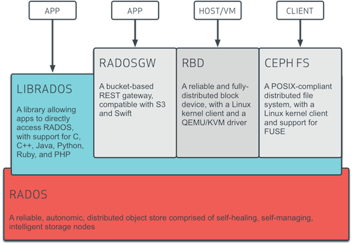

# Introduction to Cloud Infrastructure Technologies

## 1 - Virtualization

Cloud computing is a computing model that enables remote allocation of computing resources, owned by a third party, to be utilized by end users.

Cloud computing providers offer various services built on top of tools that automate basic provisioning and releasing of resources. Most of these service models fall into one of the following categories, as defined by NIST:

- Infrastructure as a Service (IaaS)
- Platform as a Service (PaaS)
- Software as a Service (SaaS).

In recent years, however, a variety of additional service models have been introduced to describe the needs and requirements of clients of remote computing services:

- Analytics as a Service (AnaaS)
- API as a Service (AaaS)
- Big Data as a Service (BDaaS)
- Business Process as a Service (BPaaS)
- Code as a Service (CaaS)
- Communications Platform as a Service (CPaaS)
- Desktop as a Service (DaaS)
- Database as a Service (DBaaS)
- Function as a Service (FaaS)
- Monitoring as a Service (MaaS)
- Anything as a Service (XaaS).

Another benefit of the cloud service model is the pay-as-you-go model adopted by cloud providers, allowing users to pay only for the cloud resources used during a set time frame. Such an approach to treat computing resources as a utility eliminates the need for high up-front investments in hardware, software, and specialized staff.

Primarily, cloud is deployed under the following models: private cloud, public cloud and hybrid cloud. However, there are other cloud deployment models as well.


A **private cloud** is designated and operated solely for one organization. It can be hosted internally or externally and managed by internal teams or a third party. A private cloud can be build using a software stack like OpenStack. A **public cloud** is open to the public and anybody can use it, after swiping the credit card, of course. Amazon Web Services, Google Cloud Platform, and Microsoft Azure are examples of public clouds. A **hybrid cloud** is a composition of two or more clouds (private, community, or public) that remain unique entities but are bound together by standardized or proprietary technology that enables data and application portability.

On the other hand, **community cloud** is a cloud infrastructure shared by several organizations and supports a specific community that has shared concerns (e.g., mission, security requirements, policy, and compliance considerations). **Distributed cloud** refers to the distribution of public cloud services to different locations while the originating public cloud provider assumes responsibility for the operation, governance, maintenance, and updates of the services. **Multicloud** is the use of multiple cloud computing services in a single heterogeneous architecture to reduce reliance on single vendors, increase flexibility through choice, and mitigate against disasters. **Polycloud** is the use of multiple cloud computing services in a single heterogeneous architecture to reduce reliance on single vendors, increase flexibility through choice, and mitigate against disasters.

In order to facilitate cloud deployment models and to implement the characteristics of cloud computing, cloud services providers and self managed cloud deployment tools take advantage of specialized software to implement hardware virtualization.

In computing, the capability to create a virtual version of a physical compute resource, including a virtual computer hardware platform, operating system, virtual storage device, and virtual compute resource, is called virtualization.

Virtualization can be achieved at different hardware and software layers, such as the Central Processing Unit (CPU), storage (disk), memory (RAM), filesystems, etc. In this chapter, we will explore a few tools that allow us to create Virtual Machines (VMs) by virtualizing essential hardware components that support the installation of a guest Operating System (OS) on them. A VM (a software equivalent of a hardware built computing machine) represents an isolated collection of emulated resources, behaving like an actual physical system.

Virtual Machines are created with the help of a specialized virtualization software, a hypervisor, that runs on a host machine. The hypervisor is a software capable of creating multiple isolated virtual operating environments, each composed of virtualized resources that are then made available to guest systems. Hypervisors are classified into two main categories.

Type-1 hypervisor (native or bare-metal) runs directly on top of a physical host machine's hardware, without the need for a host OS. Typically, they are found in enterprise settings. Examples of type-1 hypervisors:

- AWS Nitro
- IBM z/VM
- Microsoft Hyper-V
- Nutanix AHV
- Oracle VM Server for SPARC
- Oracle VM Server for x86
- Red Hat Virtualization
- VMWare ESXi
- Xen.

Type-2 hypervisor (hosted) runs on top of the host's OS. Typically, they are for end-users, but they may be found in enterprise settings as well. Examples of type-2 hypervisors:

- Parallels Desktop for Mac
- VirtualBox
- VMware Player
- VMware Workstation.

And then there are the exceptions - hypervisors matching both categories, which can be listed redundantly under hypervisors of both type-1 and type-2. They are Linux kernel modules that act as both type-1 and type-2 hypervisors at the same time. Examples are:

- KVM
- bhyve

Hypervisors enable the virtualization of computer hardware such as CPU, disk, network, RAM, etc., and allow the installation of guest VMs on top of them. We can create multiple guest VMs with different Operating Systems on a single hypervisor. For example, we can use a native Linux machine as a host, and after setting up a type-2 hypervisor, we can create multiple guest machines with different OSes, commonly Linux and Windows.

Hardware virtualization is supported by most modern CPUs, and it is the feature that allows hypervisors to virtualize the physical hardware of a host system, thus sharing the host system's processing resources with multiple guest systems in a safe and efficient manner. In addition, most modern CPUs also support nested virtualization, a feature that enables VMs to be created inside another VM.

While virtualization is the key method that allows for physical hardware to become a virtualized software resource for the purpose of VM provisioning, virtual systems may be created with the help of emulators as well. More specifically software emulation that occurs at both system and user space levels, as supported by a tool such as QEMU, allows for any OS to run on any architecture, or for programs to run on originally unsupported systems. Users can also take advantage of QEMU's flexibility and use it in conjunction with a hypervisor such as KVM to provision VMs.

### KVM

KVM is a loadable virtualization module of the Linux kernel and it converts the kernel into a hypervisor capable of managing guest Virtual Machines. Specific hardware virtualization extensions supported by most modern processors, such as Intel VT and AMD-V, have to be available and enabled for processors to support KVM. Although originally designed for the x86 hardware, it has also been ported to FreeBSD, S/390, PowerPC, IA-64, and ARM as well.


KVM enables device abstraction of network interfaces, disk, but not the processor. Instead, it exposes the /dev/kvm interface that can be used by an external user space host for emulation. KubeVirt, QEMU, and virt-manager are examples of user space tools for KVM Virtual Machine management.

KVM supports nested guests, a feature that allows VMs to run within VMs. It also supports hotpluggable devices such as CPUs and PCI devices. Overcommitting is possible as well for the allocation of additional virtualized resources that may not be available on the system. To achieve overcommitting for a VM, KVM dynamically swaps resources from another guest that is not using the type of resource needed.

Several benefits of using KVM are:

- It is an open source solution, and, as such, free to customize.
- Using KVM is beneficial from a financial perspective, due to zero costs  associated with it.
- It provides efficient hardware-assisted virtualization for an array of - guest OSes, such as Linux, BSD, Solaris, Windows, macOS, ReactOS, and - Haiku.
- It provides para-virtualization of Ethernet cards, disk I/O controllers, and graphical interfaces for guest OSes.
- It is highly scalable.
- KVM employs advanced security features, utilizing SELinux. It provides MAC (Mandatory Access Control) security between Virtual Machines. KVM has received awards for meeting common government and military security standards and for providing open virtualization for homeland security projects.

### VirtualBox

VirtualBox is an x86 and AMD64/Intel64 virtualization product from Oracle, running on Windows, Linux, macOS, and Solaris hosts and supporting guest OSes from Windows, Linux families, and others, such as Solaris, FreeBSD, and DOS. However officially, only a select few of the most common guest OSes are supported and optimized to run on VirtualBox.

It is an easy-to-use multi-platform type-2 hypervisor. Although not part of the mainline Linux kernel, it can be used by compiling and inserting the respective kernel module.

Some of the benefits of using VirtualBox are:

- It is an open source solution.
- It is free to use.
- It runs on Linux, Windows, macOS, and Solaris.
- It provides two virtualization choices: software-based virtualization and hardware-assisted virtualization.
- It is an easy-to-use multi-platform type-2 hypervisor.
- It provides the ability to run virtualized applications side-by-side with normal desktop applications.
- It provides teleportation - live migration.

### Vagrant

Using virtual machines in a development environment has numerous benefits:

- Reproducible environment
- Management of multiple projects, each in its isolated and restricted environment
- Sharing the environment with other teammates
- Keeping the development and deployment environments in sync
- Running consistently the same VM on different OSes leveraging hypervisors such as VirtualBox, VMware, and KVM.

Configuring and sharing one VM is easy, but, when managing multiple VMs for the same project, performing all the build and configuration steps manually can be tiresome. Vagrant by HashiCorp helps us automate VMs management by providing an end-to-end lifecycle utility - the vagrant command line tool. Vagrant is a cross-platform tool, as it can be installed on Linux, macOS, and Windows.

One of the key features of Vagrant is extensibility. By default, Vagrant is shipped with a limited amount of features, but, thanks to various plugins, we can extend its support for custom providers, provisioners, commands, and hosts.

Vagrant has recently added support for Docker, allowing it to manage both Containers and Virtual Machines.

Several benefits of using Vagrant are:

- It automates the setup of one or more VMs, which results in saved time, increased productivity, and lower operational costs.
- It introduces consistency in infrastructure provisioning through Vagrantfile.
- It is a flexible cross-platform tool.
- It provides support for Docker containers in addition to VMs provisioned with VMware, VirtualBox, and Hyper-V.
- It is easy to install and configure.
- It is very useful in multi-developer teams.

## 2 - Infrastructure as a Service (IaaS)

Infrastructure as a Service (IaaS) is a cloud service model that provides on-demand physical and virtual computing resources, storage, network, firewall, and load balancers. To provide virtual computing resources, IaaS uses hypervisors, such as Xen, KVM, VMware ESXi, Hyper-V, or Nitro.

Infrastructure as a Service is the backbone of all other cloud services, providing computing resources. After the provisioning of the computing resources, other services are set up on top. IaaS enables developers to provision and destroy isolated test environments as needed, when needed, quickly, and safely. The provisioning process can be easily reproduced to add consistency to the test environment, not only by the same developer, but by an entire team if desired.

Let's say that you want to have a set of ten Linux systems with 4GB RAM each and two Windows systems with 8GB RAM each to deploy your software. You can go to many IaaS providers and request these systems. Generally, an IaaS provider creates the respective VMs in the background, puts them in the same internal network, and shares any access credentials with you, thus enabling you to access them. Other than VMs, several IaaS providers offer bare-metal machines for provisioning as well.

### Amazon Elastic Compute Cloud (EC2)

Amazon Web Services (AWS) is one of the leading cloud services providers. Its cloud services, whether Platform, Software, DB, Containers, Serverless, Machine Learning, to name a few, rely heavily on its Infrastructure. Part of Amazon's Infrastructure as a Service (IaaS) model is the Amazon Elastic Compute Cloud (Amazon EC2) service. Amazon EC2 service allows individual users and enterprises alike to build a reliable, flexible, and secure cloud infrastructure for their applications and workloads on Amazon's platform. AWS offers an easy to use Console, which is a web interface for cloud resources management.

Amazon EC2 instances are in fact Virtual Machines. When provisioning EC2 instances on the AWS infrastructure, we are provisioning VMs on top of hypervisors that run directly on Amazon's physical infrastructure. In addition to the web console, AWS also offers a command line interface (CLI), a tool to manage resources with command line tools and scripts if necessary.

At the heart of the Amazon EC2 service are various type-1 hypervisors, such as Xen, KVM, and Nitro (a newer KVM-based lightweight hypervisor that delivers close to bare-metal performance).

Although Amazon EC2 is a paid service, new users are encouraged to try the AWS platform for free through AWS Free Tier offerings. While not all of its services qualify for the free tier, the ones that are available for free do come with some limitations. Several such services are offered under short-term free trials, others are offered for 12 months free, while a third group of services may be always free to all users. The three types of free offerings have been designed to encourage users to take advantage of the free tier offerings to become familiar with the most popular services the AWS platform has to offer.

When provisioning Amazon EC2 instances, users are able to manage several aspects of the instance, such as hardware profile, operating system image with software package, additional storage, the network attached to the instance, and firewall rules.

Amazon Machine Images (AMI) are preconfigured images with the information needed to launch EC2 instances. They include an operating system and a collection of software packages. AMIs are stored in an AWS repository and are used to quickly launch instances. There are default images created and maintained by AWS, the user community, or custom images we can create ourselves.

Instance Types determine the virtualized hardware profile of the instance to be launched. Each instance type is preconfigured with different compute, memory, and storage capabilities. They are categorized in instance families such as general purpose instances or optimized instances for:

- Compute (CPU) - for CPU-intensive applications such as high-performance computing (HPC), machine learning (ML), batch workloads, and media transcoding.
- Accelerated Computing (GPU) - for graphically intensive, scientific, and engineering applications, and for machine learning.
- Memory (RAM) - for in-memory databases, in-memory caches, and real-time data processing.
- Machine Learning (ML).
- Storage (SSD) - for data-intensive workloads and distributed filesystems.
When launching an instance, select an instance type based on the requirements of the application or software expected to run on the instance.

Additional configurable aspects of EC2 instances, related services, and tools may include:

- Virtual Private Cloud (VPC) for network isolation.
- Security Groups for VPC networks to control EC2 inbound/outbound traffic.
- Amazon Elastic Block Store (EBS) for persistent storage attachment.
- Dedicated hosts to provision instances on a physical machine reserved for our use.
- Elastic IP to remap a Static IP address automatically.
- CloudWatch for monitoring resources and applications.
- Auto Scaling to dynamically resize resources.

### Azure Virtual Machines

Microsoft Azure is a leading cloud services provider, with products in different domains, such as compute, web and mobile, data and storage, Internet of Things (IoT), and many others. The Azure Virtual Machine service allows individual users and enterprises alike to provision and manage compute resources, both from a web Portal or the Azure Cloud Shell, a flexible command line utility configurable to use either Bash or PowerShell.

Azure cloud services are enabled by the Azure Hypervisor, a customized version of Microsoft Hyper-V type-1 hypervisor. The Azure Hypervisor promises high efficiency, performance, and scalability over a small footprint thanks to the optimization of the custom Hyper-V hypervisor coupled with its tight integration with the physical infrastructure.

The Azure Virtual Machine is a paid service, however, the Azure free account offering aims to attract new users and encourage them to explore the cloud services the Azure platform has to offer. Between an initial credit limited to the first 30 days following the opening of the free account, popular services free for 12 months, and a set of always free services, users have several options enabling them to become familiar with the most popular services the Azure cloud platform has to offer.

During the VM provisioning process, Azure users are able to manage various instance aspects such as the Operating System, VM size, storage, networking, and firewall rules.

The VM Image field defines the base Operating System or the application for the VM. Both Linux VMs and Windows VMs can be launched from images available through the Azure Marketplace.

The VM size determines the type and capacity of the compute, memory, storage and network resources for the VM to be launched. VMs are grouped in families based on their intended usage. General purpose for development and testing environments, low traffic web servers, and small databases or optimized VMs for:

- Compute (for CPU intensive applications) for medium traffic web servers, batch processes and application servers.
- GPU for heavy graphic rendering, video editing, and deep learning.
- Memory (RAM) for relational databases and in-memory analysis.
- High Performance Compute (HPC).
- Storage for data warehousing and large transactional databases.
A
dditional configurable aspects of VMs:

- Network security groups to manage network traffic.
- SSD or HDD for persistent storage attachment, with optional encryption.
- Dedicated hosts to provision VMs on a physical machine reserved for our use.
- Accelerated networking for low latency and high throughput.
- Virtual network for network isolation.
- Monitoring resources and applications.
- Resource Manager templates for VM deployment.
- Seamless hybrid connections.
- Automated backups.

### DigitalOcean Droplets

DigitalOcean is a leading cloud services provider, aiming its cloud platform at both individual users and enterprises. DigitalOcean helps you create a simple cloud quickly, as it promises IaaS virtual instances set up within seconds. DigitalOcean cloud services enable application deployments and scaling on a cloud infrastructure available worldwide, leveraging network and storage flexibility together with security and monitoring tools.

In the DigitalOcean ecosystem, the virtual compute instances are called droplets, and they are Linux-based VMs launched on top of the KVM type-1 hypervisor, with SSD (Solid-State Drive) as their primary storage disk.

DigitalOcean offers paid cloud services, but users can take advantage of a short-term credit towards cloud services, part of a free tier offering aimed to encourage users to explore and become familiar with its offerings.

DigitalOcean droplets are easy to configure, users being able to manage the resource profile, guest Operating System, application server, security, backup, monitoring, and more.

Resource profiles are directly associated with DigitalOcean cost plans and are categorized in Shared CPU and Dedicated CPU plans.

The Shared CPU plan includes the Basic Droplets with burstable vCPU and memory that can be configured to support the running of web servers, forums, and blogs.

The Dedicated CPU plan includes dedicated vCPUs and a specific amount of memory per each vCPU that further determines the droplet type:

- General Purpose with 4GB of memory for each vCPU, to support high traffic web servers, e-commerce, and SaaS.
- CPU-Optimized with 2GB of memory for each vCPU, to support Machine Learning, CI/CD, and video encoding.
- Memory-Optimized with 8GB of memory for each vCPU to support high-performance DBs, and real-time big data processing.

The droplet guest OS can be picked from a list of Linux distribution images, such as CentOS, CoreOS, Debian, Fedora, FreeBSD, and Ubuntu. While custom images can be built and used, droplets can be pre-configured to run applications such as Docker, LAMP, MongoDB, MySQL, and Node.js.

Users can take advantage of additional configurable services and features:

- Monitoring to collect performance metrics.
- Cloud Firewalls to secure the network infrastructure.
- Backups that can be automated, allowing for easy droplet restores or to launch new pre-configured droplets.
- Snapshots to be used as restore points after a failed upgrade or configuration change.
- Team Management for collaboration.
- Block Storage for droplet storage.
- Spaces for scalable and secure storage solutions aimed to store and deliver data.
- Load Balancers for traffic distribution.
- Floating IPs for flexibility when assigning IPs to droplets and to release them when no longer needed.
- APIs for programmatic droplet launching.
- Networking features, such as DNS, IPv6, private networking.

### Google Compute Engine (GCE)

Google Cloud Platform (GCP) is one of the leading cloud services providers. Its infrastructure is the foundation for all other cloud services, whether Platform, Software, Containers, Serverless, Artificial Intelligence, Machine Learning, to name a few. Part of Google's Infrastructure as a Service (IaaS) model is the Compute Engine service. Google Compute Engine (GCE) service allows individual users and enterprises alike to build a reliable, flexible, and secure cloud infrastructure for their applications and workloads on Google's platform. GCP offers an easy to use Console, which is a web interface for cloud resources management.

GCE instances are in fact Virtual Machines. When provisioning GCE instances on the GCP infrastructure, we are provisioning VMs on top of hypervisors that run directly on Google's physical infrastructure. In addition to the web Console, GCP also offers a command line interface (CLI), a tool to manage resources with command line tools and scripts if necessary.

GCE services are enabled by the KVM type-1 hypervisor, running directly on Google's physical infrastructure and allowing for VMs to be launched with Linux and Windows guest Operating Systems.

GCE is a paid service, however, new users are encouraged to try the GCP platform for free through the GCP Free Tier offering. The Free Tier offers new users a chance to become familiar with the most popular services the Google Cloud Platform has to offer with the help of short-term initial free credits and several products that are always free within predefined usage limits.

Google Compute Engine service allows users to configure many of the VM instance characteristics, such as machine profile, image, storage, network, security, and access control.

GCE Machine Types determine the virtualized hardware configuration for VMs to be provisioned. Based on available configurations, VMs are categorized in various machine type families aimed to support specific types of applications and workloads:

- General-purpose machines offer the best price-performance ratio. This family includes machine types N1, N2, N2D, E2.
- Memory-optimized designed for memory-intensive workloads.
- Compute-optimized for compute-intensive workloads.
- Accelerator-optimized for machine learning (ML), high-performance computing (HPC), and GPU-dependent workloads.
- Shared-core for cost-effective light-weight applications. Several machine types from the N1 and E2 machine families share a physical core to minimize costs.

GCE Images determine the guest Operating System of the VMs. While there are several public images available to launch VMs, users can create custom Images as well.

Additional configurable aspects of GCE VMs, and related services:

- Storage Disks for VM attached storage volumes.
- Networking VPC and Firewalls for network isolation and security.
- Snapshots for fast GCE persistent disk backups and recovery.
- Cloud Security Scanner to scan applications for security vulnerabilities.
- Health Checks to probe VMs health.
- Sole-tenant Nodes for dedicated physical Compute Engines.
- Network Endpoint Group representing collections of IP addresses for load balancing, firewalls, and logging purposes.

### IBM Cloud Virtual Servers

IBM Cloud is one of the leading cloud services providers for enterprises and academic institutions. It includes the typical service models, the Infrastructure as a Service (IaaS), Software as a Service (SaaS), and Platform as a Service (PaaS) offered through public, private, and hybrid cloud delivery models. Part of the IBM Cloud IaaS model is the IBM Cloud Virtual Servers service, also known as Virtual Machines, one of the many services providing cloud compute services. IBM Cloud Virtual Servers provide interoperability between virtual and bare-metal servers by being deployed on the same VLANs as the physical servers. When you create an IBM Cloud Virtual Server, you can choose between multi-tenancy or single-tenancy environments, and also high-performance local disks or enterprise SAN storage.

IBM Cloud is the successor of two joined technologies - the IBM mainframe and virtualization. IBM treats virtualization with some level of flexibility. While it uses IBM z/VM and IBM PowerVM, two powerful hypervisors, to manage its own virtual workload, the users of IBM Cloud are allowed to choose between XenServer, VMware, and Hyper-V hypervisors when managing bare-metal instances. This level of hypervisor flexibility is one of the advantages of IBM Cloud, and one of the top reasons why users pick IBM Cloud over another cloud service provider.

IBM Cloud services are available at a cost, however, the IBM Cloud Free Tier offer allows users to explore always free cloud services in combination with a predetermined amount of free credits available short-term to be used towards specific cloud resources.

When provisioning IBM Cloud Virtual Servers, users are able to manage different server aspects, such as profile, image, software package add-ons, attached storage, network interface bandwidth, internal and external firewall rules, IP addresses, and VPN. Most of these server aspects are available for the four supported types of virtual servers:

- Public for multi-tenants
- Dedicated for single-tenants
- Transient for ephemeral multi-tenants
- Reserved for multi-tenants committed for a pre-specified term.

Profiles specify the size of the virtual server and are associated with predefined resource amounts that the servers get launched with. While there are popular profiles specifying a balanced collection of compute, memory, and storage resources, there are optimized profiles aimed at specific workload types:

- Balanced for common cloud workloads requiring a balance between performance and scalability, with network-attached storage (NAS).
- Balanced local storage for medium to large databases that require high I/O, with local HDD storage.
- Compute for compute-intensive deployments such as moderate to high traffic web servers.
- Memory for caching and analytics workloads.
- Variable compute for workloads without constant high-CPU performance.
- GPU for high-performance deployments.

Virtual server images are preconfigured with the information needed to launch IBM Cloud Virtual Servers. They include an operating system such as a Linux distribution or Windows, and optional software package add-ons.

### Linode Compute Instances

Linode, presently a subsidiary of Akamai Technologies, is the cloud computing service provider at the core of Akamai Connected Cloud. Linode offers a variety of cloud computing plan types that range from Shared CPU to GPU for most demanding compute workloads. Linode offers users a stable infrastructure on Linux VMs that is advertised as a discounted solution for infrastructure provisioning and hosting, aggressively challenging cloud platforms such as AWS and Azure.

Linode combines a diverse set of offerings with the user friendliness of an easy to use management dashboard. Its popular compute, storage, network, and resource management tools blended with Akamai’s advanced content delivery network (CDN) and security services turned the joint venture into a powerful cloud services provider. Users can take advantage of the Linode Compute service to provision robust, secure, yet inexpensive infrastructure that can satisfy a vast array of computing requirements. The following plan types are available to provision compute infrastructure:

- Shared CPU Plans are the most inexpensive type, aimed to support development and staging environments, and web applications.
- Dedicated CPU Plans are designed for production environments and high traffic database applications.
- Premium Plans are targeted at enterprise level business use cases, and latency sensitive application deployments.
- High Memory Plans are optimized for memory intensive use cases such as in-memory databases and caching, and big data processing.
- GPU Plans, based on NVIDIA RTX 6000 hardware, are suited for complex parallel processing needs, AI, ML, big data analysis, and graphics/video processing.

### Oracle Cloud Compute Virtual Machines

Oracle is a leading cloud services provider through its Oracle Cloud offering. Oracle's IaaS cloud service model is implemented by a wide range of Cloud Infrastructure products. A commonly used infrastructure product is Cloud Compute, which includes several options to support various types of I/O intensive workloads, high-performance computing (HPC), and artificial intelligence (AI). These options are represented by Cloud Compute Instances that include Virtual Machines (VMs), Bare Metal Servers, GPU-optimized VMs and Bare Metal Servers, alongside Autonomous Linux instances, and instances optimized for Container Registries and Container Engines for Kubernetes.

Oracle Cloud Infrastructure Compute Virtual Machines are offered in many shapes with Oracle Compute Units (OCPUs) to support a wide range of workloads and software platforms, allowing for storage support customization from remote block storage to high local SSD storage capacity.

At the core of the Oracle Cloud Infrastructure are Bare Metal Servers capable of supporting Nested Virtualization when paired with a hypervisor such as KVM.

Oracle Cloud is also a paid offering, however, similar to several other cloud providers, Oracle too has a Free Tier offering. The free tier is composed of a set of Always Free services, coupled with free credit towards additional eligible infrastructure services, available for a limited time upon signing up. The free tier encourages users to navigate the Oracle Cloud services and to become familiar with the most popular options and features.

Oracle Cloud Infrastructure VMs offer flexible performance paired with strong isolation thanks to cloud-optimized hardware, software, and networking, all at an advantageous cost.

Infrastructure VMs are offered in several shapes, which are determined by the virtual hardware profile of the instance:

- Standard, or general-purpose instances, offering a balance between compute, memory, and networking resources, suitable for most common use cases.
- Dense IO, or high-performance instances, paired with large local non-volatile memory express (NVMe) SSD storage, suitable for large database applications.
When provisioning Cloud VMs, users are able to manage additional instance aspects and related services:

- Flexible image management by allowing users to choose between images based on enterprise Linux distributions or Windows Server, to bring their own custom guest operating systems, or to choose an image from an Oracle partner.
- Low latency block storage for boot volumes, for increased performance and reliability, and to facilitate backups and restores.
- Secure and flexible network through fully customizable private Virtual Cloud Networks (VCN).
- High availability by distributing application deployments in multi-regions, multi-availability domains or multi-fault domains, ensuring fault isolation, and low latency across availability domains.

### OpenStack

We have seen examples for consuming the services of different cloud providers to provision our infrastructure. What if we want to become a cloud provider and offer cloud computing services?

OpenStack allows users to build a cloud computing platform for public and private clouds. OpenStack was started as a joint project between Rackspace and NASA in 2010. In 2012, a non-profit corporate entity, the OpenStack Foundation, was formed to manage it while receiving the support of more than 500 organizations. OpenStack is an open source software platform released under an Apache 2.0 License, and it is currently part of the OpenInfra Foundation.

In addition to providing a IaaS solution, OpenStack has evolved over time to provide other services, such as Database, Storage, and Networking.

The modular nature of OpenStack allows users to design and implement components for specific features or functionality. OpenStack components provide APIs for accessing infrastructure resources by cloud end users.

- **Nova** is a compute service that implements scalable and on-demand access to compute resources, including bare metal, virtual machines, and containers.
- **Ironic** is a bare metal provisioning service part of Hardware lifecycle services.
- **Cyborg** is a lifecycle management service for GPU and ASIC-based devices, part of Hardware lifecycle services.
- **Swift** is the object store part of Storage services that provides a highly available, distributed, eventually consistent object/blob store.
- **Cinder** is the block storage part of Storage services that provides an abstraction layer over the management of block storage devices through a self-service API.
- **Manila** is the shared filesystem part of Storage services, provides coordinated access to shared or distributed filesystems.
- **Neutron** is a networking service, a Software Defined Networking (SDN) delivering networking as a service (NaaS) in virtual compute environments.
- **Octavia** is the load balancer part of Networking services, delivering on-demand and horizontal scaling load balancing as a service (LBaaS) to fleets of VMs, containers, or bare-metal servers.
- **Designate** is the DNS-as-a-Service part of Networking services.
- **Keystone** is the identity service part of Shared services, provides authentication, service discovery, and authorization. It supports LDAP, OAuth, OpenID Connect, SAML, and SQL.
- **Glance** is the image service part of Shared services, provides VM image discovery, registration, and retrieval.
- **Heat** is the orchestration service provides orchestration of infrastructure resources for cloud applications that also supports autoscaling.
- **Senlin** is the clustering service part of Orchestration services eases the orchestration of clusters of similar objects.
- **Magnum** is the container orchestration engine provisioning service part of Workload provisioning services provisions Docker Swarm, Kubernetes or Apache Mesos to run on a cluster of VMs or bare-metal servers.
- **Sahara** is the framework provisioning service for the Big Data processing part of Workload provisioning services.
- **Freezer** is the Backup, Restore, and Disaster Recovery service part of Application lifecycle services, provides efficient and flexible block-based backups, file-based incremental backups, synchronized backups over multiple nodes, while it supports multiple OSes (Linux, Windows, macOS).
- **Horizon** is the dashboard service part of Web frontend services provides an extensible web-based user interface to manage OpenStack services.
- **Ceilometer** is the metering and data collection service, an operations tool part of Monitoring services, provides efficient data collection, normalization, and transformation for telemetry purposes.
- **Monasca** is the monitoring service, an operations tool part of Monitoring services, provides highly-scalable, fault-tolerant monitoring as a service solution (MaaS), together with high-speed metrics processing, querying, alarm, and notification engines.
- **Cloudkitty** is the billing and chargeback service, an operations tool part of Billing and Business logic services, introduces rating as a service (RaaS) to convert rating metrics into service pricing.
- **Rally** is used for benchmarking and performance analysis; it is an operations tool part of Testing/Benchmarking services that automates the detection of the impact changes in software architecture and hardware have on the OpenStack performance.
- **Kuryr** is the networking integration enabler for containers running on OpenStack.

### Vultr Cloud Compute Virtual Machines

Vultr is a younger cloud services provider that aims to simplify the way cloud is consumed by developers and businesses. Through its worldwide network of datacenters, Vultr enables its users to provision public cloud, cloud storage, single-tenant bare metal systems, and highly reliable high performance cloud compute environments.

Vultr supports a wide range of business solutions, from simple Web Hosting, Machine Learning (ML), and AI to Blockchain, and High Performance Computing (HPC). It integrates shared virtual CPUs, AMD CPUs, Intel CPUs, and GPUs with regular SSD and NVMe SSD into its infrastructure offering a wide array of Cloud Compute Virtual Machines.

Vultr is a paid offering; however (as of October 2024), it has a free offering through free credit, limited to the first 30 days of a newly opened account, aimed to encourage users to explore the Vultr Cloud Compute and Cloud Storage services and to become familiar with its most popular options and features.

Factoring in all the possible combinations of compute and storage hardware in Vultr’s inventory, there are various Cloud Compute instance categories available to end-users:

- Cloud Compute VMs suitable for low traffic websites, blogs, and small databases. They leverage shared virtual CPUs and include Regular Performance, High Performance, and High Frequency VMs.
- Optimized Cloud Compute VMs are designed for specialized use cases. They include General Purpose suitable for E-Commerce, game servers, video streaming; CPU Optimized suitable for video encoding, HPC, analytics processing; Memory Optimized suitable for in-memory databases and caches, real-time analytics; and Storage Optimized suitable for non-relational databases, and high frequency online transaction processing (OLTP).
- Cloud GPU leveraging NVIDIA hardware suitable for AI, HPC, and virtual desktops.
- Bare Metal physical instances satisfying challenging single-tenant requirements of most demanding businesses.

## 3 - Platform as a Service (PaaS)

Platform as a Service (PaaS) is a cloud service model representing a class of cloud computing services that allow users to develop, run, and manage applications while concealing the tasks involved in the management of the underlying infrastructure. With PaaS, users are able to concentrate their efforts on building their applications, which is a great benefit to developers.

Users have a choice between managed and self-managed PaaS solutions. Managed PaaS solutions are hosted by cloud computing providers like Amazon AWS, Microsoft Azure, Google Cloud Platform (GCP), IBM Cloud, and Oracle Cloud, while an on-premises PaaS can be deployed as a self-managed solution, using a platform such as Red Hat OpenShift. Such a Platform benefits the end user by abstracting infrastructure provisioning and application runtime dependencies installation, configuration, and maintenance.

PaaS can be deployed on top of IaaS or independently on VMs, bare-metal servers, and containers.

Third party certified PaaS solutions are becoming increasingly popular as well. These certified solution providers are software vendors who bundle highly desired software platforms with IaaS offerings of cloud infrastructure providers to present a PaaS to their respective clients. Such certified platform solutions are achieved through extensive customization, and the final bundled solutions are presented as distributions of the original highly desired software.

### Cloud Foundry

Cloud Foundry (CF) is an open source Platform as a Service (PaaS) framework aimed at developers in large organizations, that is portable to any cloud, highly interoperable, has an architecture supporting any programming language, and integrates easily with various cloud and on-premises tools. In addition to supporting any type of application, it provides means for these applications to access external resources through application services gateway.

While CF can be deployed on-premises, it is recommended to install it on one of the supported IaaS, such as Amazon AWS, Microsoft Azure, Google Cloud Platform (GCP), IBM Cloud, OpenStack, or VMware vSphere. Stable Cloud Foundry releases are also available through several certified commercial distributions as well, such as Atos Cloud Foundry, Cloud.gov, SAP Cloud Platform, VMware Tanzu (formerly known as Pivotal Cloud Foundry), or others.

CF aims to address challenges faced by developers in large organizations through a collection of customized technologies. Popular core components such as the Cloud Foundry API, CF CLI, Korifi, Garden, Diego, Eirini, Paketo Buildpacks, Stratos UI, together with BOSH, Quarks, and a set of extensions such as the Open Service Broker API make up the Cloud Foundry platform.

#### Cloud Foundry BOSH

Cloud Foundry BOSH is an open source tool for release engineering, deployment, lifecycle management, and monitoring of complex distributed systems, enabling developers to easily version, package and deploy software in a reproducible manner.

BOSH aims to ease the process of building and administering consistently similar environments from development to staging and production. BOSH was designed to be the one tool to solve versioning, packaging, and reproducible software deployments as a whole, a collection of activities otherwise performed by tools such as Chef, Puppet, and Docker in various non-standard approaches.

BOSH follows the four principles of release management:

- identifiability of all components making up a release,
- reproducibility of integration that guarantees operational stability,
- consistency through a stable framework for development, deployment, audit and software components accountability, and
- agility for software release automation according to software engineering best practices for Continuous Integration and Continuous Delivery.

BOSH can be installed on-premises on supported OSes such as several Linux distributions, macOS, and Windows. A popular on-premises hypervisor, VirtualBox is also supported. BOSH can be installed on supported IaaS providers as well, such as AWS, Microsoft Azure, GCP, IBM Cloud, OpenStack, VMware.

A powerful feature of the Cloud Foundry platform is its command line interface (CLI) that allows users to interact with various components of the platform to manage infrastructure and application deployments.

Applications can be pushed to Cloud Foundry through the `cf push` command, one of the many commands part of the cf CLI. This command is highly customizable, however, it can be easily run with default settings even by novice users of the Cloud Foundry platform. It supports popular programming languages such as Java, Node.js, Python, PHP, Go, Ruby, and .Net, but it can be extended to support additional languages and developer frameworks through community-developed buildpacks.

#### Korifi

Current trends require applications to become lighter, faster, easier to share, secure, maintain, and manage. And most often these applications are designed to run in the cloud, whether on-premises, public, or hybrid, named cloud native applications. These application characteristics also reshape the application build models and tools that need to become cloud native themselves. While containers and container orchestration concepts and tools will be discussed in later chapters, complex platforms such as Cloud Foundry can become cloud native as well. Converting CF into a cloud native tool is not an effortless process, however, the result is a CF project named Korifi. It is a CF offering redesigned from the ground up for another platform, Kubernetes, a popular container orchestrator.

The Korifi project aims to abstract CF components and dependency configuration, enabling the developer to focus on building applications. This further helps to widen the environment options where CF can be deployed, as containers and container orchestrators are platforms supported by a large array of cloud services, IaaS, and certified solution providers.

### Red Hat OpenShift

Red Hat OpenShift is an open source PaaS solution provided by Red Hat. It is built on top of the container technology orchestrated by Kubernetes. OpenShift can be deployed in the cloud as a managed service or as a self-managed deployment on a public or private cloud optimized to run containers and Kubernetes.

Red Hat offers several products under OpenShift, categorized by their deployment models.

- Red Hat OpenShift - Managed  
    Hosted OpenShift deployments on public cloud platforms managed by Red Hat. This model includes the Red Hat OpenShift Service on AWS, Red Hat OpenShift on IBM Cloud, and Microsoft Azure Red Hat OpenShift.
- Red Hat OpenShift Platform Plus - Self-Managed  
    Create your own private, secure Kubernetes multi-cluster PaaS.
- Red Hat OpenShift Container Platform  
    Create your own self-managed consistent hybrid cloud PaaS to build and scale containerized applications.
- Red Hat OpenShift Kubernetes Engine - Self-Managed  
    An entry-level solution promoting the advantages of OpenShift over other Kubernetes solutions, supported by Red Hat.

Red Hat OpenShift allows developers to easily and quickly deploy containerized applications through application images and application templates enabled for one-click application deployments.

Thanks to Kubernetes, Red Hat OpenShift receives all the features offered by the container orchestration platform, such as adding or removing nodes at runtime, persistent storage, and auto-scaling.

Red Hat OpenShift integrates well with Continuous Deployment tools to deploy applications as part of the CI/CD pipeline.

Applications are managed with ease through command line (CLI) tools, web user interface (UI), and integrated development environment (IDE) available for Red Hat OpenShift.

### Heroku

Heroku Platform
Heroku is a fully-managed container-based cloud platform with integrated data services and a strong ecosystem. Heroku is used to deploy and run enterprise level modern applications, and it is a Salesforce company.

Heroku offers multiple products; however, its core remains the Heroku Platform, a PaaS solution used to deploy large scale applications. The Heroku Platform supports the following popular languages and frameworks: Ruby, Java, Node.js, Python, PHP, Go, Scala, and Clojure.

Heroku sets itself apart from other PaaS offerings by introducing a unique workflow for users to follow, hence a strict Heroku-centric development and deployment workflow needs to be followed once the decision has been made to use Heroku. However, the workflow aims to be developer-friendly. Below are several core concepts of the workflow:

- Applications should contain the source code, its dependency information and the list of named commands to be executed when deployed, in a file called Procfile.
- For each supported language, it has a pre-built image which contains a compiler for that language. This pre-built image is referred to as a buildpack. Multiple buildpacks can be used together. We can also create a custom buildpack.
- While deploying, we need to send the application's content to Heroku, either via Git, GitHub, or via an API. Once the application is received by Heroku, a buildpack is selected based on the language of preference.
- To create the runtime which is ready for execution, we compile the application after fetching its dependency and configuration variables on the selected buildpack. This runtime is often referred to as a slug.
- We can also use third-party add-ons to enable access to value-added services like logging, caching, monitoring, etc.
- A combination of slug, configuration variables, and add-ons is referred to as a release, on which we can perform upgrade or rollback.
- Depending on the process-type declaration in the Procfile, a virtualized UNIX container is created to serve the process in an isolated environment, which can be scaled up or down, based on the requirements. Each virtualized UNIX container is referred to as a dyno. Each dyno gets its own ephemeral storage.
- Dyno Manager manages dynos across all applications running on Heroku.

The Heroku Platform allows users to deploy, run, and manage applications written in multiple programming languages or frameworks, from source code that may also include dependencies.

By encapsulating the application in a dyno, which is a lightweight and secure container, the application can be scaled based on demand.

Application configuration can be decoupled from the application source code, allowing for application customization based on the environment where the application is deployed. Configuration customization is achieved through config vars, which combined with the application slug, produce a release.

It is a very rich ecosystem, and it allows us to extend the functionality of an application with add-ons available in the Elements Marketplace. Add-ons allow us to easily integrate our applications with other fully-managed cloud services such as storage, database, monitoring, logging, pipelines, email, message queue, security, and networking.

Applications deployed on the Heroku Platform can be easily integrated with Salesforce.

## 4 - Containers

Typically, a developer's end goal to run an application is not too difficult to achieve. However, challenges are encountered with portability, when the application needs to work consistently on multiple hardware and platforms, such as the developer's laptop, VMs, data centers, public and private clouds, basically, from the development environment all the way to production.


Developers prefer not to trouble themselves with the portability and consistency aspects of applications and expect the application to just work, regardless of the underlying platform. By using a container technology such as Docker or Podman, the application and all its dependencies can be bundled in a box.


The box can be shipped to different platforms and it will run identically on each one of them. Key benefits of using containers are:

- They have a very light footprint.
- They can be deployed very fast (within milliseconds).
- They are a flexible solution, as they can run on any computer, infrastructure, or cloud environment.
- They can be scaled up or down with ease.
- There is a very rich ecosystem built around them.
- Problem containers can be easily and quickly isolated when troubleshooting and solving problems.
- Containers use less memory and CPU than VMs running similar workloads.
- Increased productivity with reduced overhead.
- They offer portability and consistency.

### Images and containers

In the container world, this box containing our application source code and all its dependencies and libraries is referred to as an image. A running instance of this box is referred to as a container. We can run multiple containers from the same image.

An image contains the application, its dependencies, and the user-space libraries. User-space libraries like `glibc` enable switching from the user-space to the kernel-space. An image does not contain any kernel-space components.

When a container is created from an image, it runs as a process on the host's kernel. It is the host kernel's job to isolate the container process and to provide resources to each container.

We will now take a look at some of the building blocks of the container technology, provided by the Linux kernel.

#### Namespaces

A namespace wraps a particular global system resource like network and process IDs in an abstraction, that makes it appear to the processes within the namespace that they have their own isolated instance of the global resource. The following global resources are namespaced:

- pid - provides each namespace to have the same PIDs. Each container has its own PID 1.
- net - allows each namespace to have its network stack. Each container has its own IP address.
- mnt - allows each namespace to have its own view of the filesystem hierarchy.
- ipc - allows each namespace to have its own interprocess communication.
- uts - allows each namespace to have its own hostname and domain name.
- user - allows each namespace to have its own user and group ID number spaces. A root user inside a container is not the root user of the host on which the container is running.

#### cgroups

Control groups are used to organize processes hierarchically and distribute system resources along the hierarchy in a controlled and configurable manner. The following cgroups are available for Linux:

- blkio
- cpu
- cpuacct
- cpuset
- devices
- freezer
- memory

#### Union filesystem

The Union filesystem allows files and directories of separate filesystems, known as layers, to be transparently overlaid on top of each other, to create a new virtual filesystem. At runtime, a container is made of multiple layers merged to create a read-only filesystem. On top of a read-only filesystem, a container gets a read-write layer, which is an ephemeral layer and it is local to the container.

### Container runtimes

Namespaces and cgroups have existed in the Linux kernel for quite some time, but consuming them to create containers was not easy. Although the first steps towards containerization can be traced back to 1979 with the process isolation achieved through chroot, followed by Linux Containers (LXC) released in 2008, it was the launch of Docker in 2013 that allowed containers to become more popular. Docker was able to hide all the complexities in the background and came up with a simple workflow to share and manage both images and containers. Docker achieved this level of simplicity through a collection of tools that interact with a container runtime on behalf of the user. The container runtime ensures the containers' portability, offering a consistent environment for containers to run, regardless of the infrastructure.

Once containers have become popular and container orchestration was emerging as a concept with Kubernetes becoming its primary implementation, in 2014 we saw a new container runtime being born - rkt, implementing a newly introduced set of standards, the App Container (appc) specification defining the Application Container Image (ACI) format. Shortly after, a new standard has been introduced in 2015, the Open Container Initiative (OCI), setting the stage for several new projects such as Skopeo, Buildah, and Podman, all providing sets of open source tools to allow users a quicker, more secure, daemonless, and less resource-intensive containerization experience. Kaniko has also been introduced, a project aiming to integrate the Dockerfile-based container image build process with Kubernetes, or any other environment that cannot run a Docker daemon. While the containers landscape was evolving, a new container runtime has been introduced, CRI-O - a lightweight runtime implementing Kubernetes' Container Runtime Interface (CRI) standard to allow OCI-compliant containers to be run and managed by the container orchestrator.

#### runC

Over the past few years, we have seen rapid growth in the interest and adoption of container technologies. Most of the cloud providers and IT vendors offer support for containers. To make sure there is no vendor locking and no inclination towards a particular company or project, IT companies came together and formed an open governance structure, called The Open Container Initiative (OCI), under the auspices of the Linux Foundation. The governance body came up with both runtime and image specifications to create standards on the Operating System process and application containers. runC is the CLI tool for spawning and running containers according to these specifications, also categorized as a low-level runtime. runc is a Go language-based tool that creates and starts container processes. An OCI container runtime is expected to fork off the first process in the container, but Go does not have good support for the fork/exec model of computing. Go follows a threading model that expects programs to fork a second process and then to exec immediately.

#### crun

crun is a much faster and low-memory footprint OCI-conformant runtime written in C. crun is lighter than runc because its C source code allows its compiled size to be 50x smaller and to run about 2x faster. C is not multi-threaded, but it follows the fork/exec model, meeting the OCI runtime expectation.

#### containerd

containerd is an OCI-compliant container runtime with an emphasis on simplicity, robustness, and portability. As a high-level runtime, it runs as a daemon and manages the entire lifecycle of containers. It is available on Linux and Windows operating systems. Docker, also run as a daemon, is a containerization platform that uses containerd as a runtime to manage runC containers.

#### CRI-O

CRI-O is an OCI-compatible runtime, which is an implementation of the Kubernetes Container Runtime Interface (CRI). It is a lightweight high-level alternative to using Docker as the runtime for Kubernetes.

### Containers vs VMs

A virtual machine is provisioned with the help of a hypervisor, the software layer that virtualizes a host system's hardware resources such as CPU, memory, and networking to allow a guest OS to be installed and take advantage of them. Various guest OSes can be installed on top of a hypervisor. However, between an application running inside a guest OS and in the outside world, there are multiple layers: the guest OS, the hypervisor, and at times the host OS.


In contrast to VMs, containers run directly as processes on the host OS. There is no middle layer as we see in VMs, which helps containers to achieve near-native performance. Also, as the containers have a very light footprint, it becomes easier to pack a higher number of containers than VMs on the same physical machine. However, as containers run on the host OS, we need to make sure containers are compatible with the host OS.

### Docker

Docker, Inc. is a company that provides the Docker Platform to run applications using containers. The Docker Platform is a collection of development tools that follow a client-server architecture, with a Docker Client connecting to a Docker Host server that runs the Docker daemon to execute commands for containers and images management in response to client requests. Docker also offers a GUI that allows developers to interact with images and containers in a visual fashion - the Docker Desktop for Linux, macOS, and Windows.

Docker is capable of running rooted containers by default. However, as a result of security and vulnerability concerns voiced by its users, Docker has introduced the rootless containers mode as well, aiming to address issues such as privilege escalation. The container image build process is predominantly driven by the popular Dockerfile.

While not an exhaustive list, the basic Docker CLI operations are enumerated below:

- List images available in the local cache: `$ docker image ls`
- Pulling an alpine image from the registry into the local cache: `$ docker image pull alpine`
- Run a container from an image (if the image is not found in the local cache, it will be pulled from the registry): `$ docker container run -it alpine sh`
- Run a container in the background (-d option) from an nginx image: `$ docker container run -d nginx`
- List only running containers: `$ docker container ls`
- List all containers: `$ docker container ls -a`
- Inject a process inside a running container. This will start a bash shell in interactive (-i option) terminal (-t option) mode inside the container: `$ docker container exec -it <container_id/name> bash`
- Stop a running container: `$ docker container stop <container id/name>`
- Delete a stopped container: `$ docker container rm <container id/name>`

### Podman

Podman, or Pod Manager, is an open source, daemonless tool designed to simplify the searching, running, building, sharing, and deploying of applications using Open Containers Initiative (OCI) containers and container images. Podman provides a command line interface (CLI) that is very similar to the Docker CLI. It comes with a GUI that allows developers to interact with images and containers in a visual fashion - the Podman Desktop for Linux, macOS, and Windows. Podman also relies on an OCI-compliant Container Runtime such as runc to create the running containers, making it a great alternative containerization tool to Docker. Another Podman advantage is its capability to run containers in rootless mode by default, while rooted mode is also supported if desired. Docker on the other hand only recently has introduced rootless mode, while rooted container mode has been its default mode. Podman's image building process may use a Containerfile, similar in format to the popular Dockerfile.

Red Hat, the developers of Podman, created two additional open source tools designed to operate within the container images landscape. Buildah supports container image builds one step at a time by taking an interactive approach to processing Dockerfile instructions, while Skopeo is a tool designed to work with container images in both local and remote repositories.


The side by side comparison highlights the essential difference between Docker and Podman - that the Docker CLI interacts with the Docker daemon prior to invoking the containerd daemon responsible to run the runc runtime, while Podman is a daemonless tool capable of running the runc runtime without an intermediary daemon such as containerd.

As a result of the CLI similarities, to preserve the developers experience when transitioning from Docker to Podman, simply set the following alias docker=podman. While not an exhaustive list, the basic Podman CLI operations are enumerated below:

- List images available in the local cache: `$ podman image ls`
- Pulling an alpine image from the registry into the local cache: `$ podman image pull alpine`
- Run a container from an image (if the image is not found in the local cache, it will be pulled from the registry): `$ podman container run -it alpine sh`
- Run a container in the background (-d option) from an nginx image: `$ podman container run -d nginx`
- List only running containers: `$ podman container ls`
- List all containers: `$ podman container ls -a`
- Inject a process inside a running container. This will start a bash shell in interactive (-i option) terminal (-t option) mode inside the container: `$ podman container exec -it <container_id/name> bash`
- Stop a running container: `$ podman container stop <container id/name>`
- Delete a stopped container: `$ podman container rm <container id/name>`

### Additional CLI tools

The popularity of both Docker and Podman has a lot to do with the capabilities of their embedded CLI clients. Users have the client available at all times, being part of the installation packages. They can immediately operate on the container runtime, container images, and running containers, be it configuration, development, testing, or troubleshooting operations. Both Docker and Podman CLI clients support an extensive set of commands.

The containerd runtime came paired with the ctr client, which was no match for Docker and Podman clients. While the ctr project is no longer maintained, a newer client, nerdctl, advertised as a Docker-compatible client for containerd aims to make containerd more user friendly. Eventually, another client, crictl, was created to support CRI-O. However, crictl can be configured for containerd and Docker as well.

### Project Moby

As we know, a container platform like Docker runs on different platforms and architectures: bare metal (both x86 and ARM), Linux, macOS, and Windows. We can also find pre-configured VM images to run Docker on popular cloud and virtualization providers.

From the user perspective, the experience is seamless, regardless of the underlying platform. However, behind the scenes, components such as the container runtime, networking, and storage are connected to ensure this high-quality experience. Open source projects like containerd and libnetwork are part of the container platform and have their own release cycles and governing models. The question is, however, how can we take those individual components and build a container platform like Docker?

Project Moby is the answer. It is an open source project that provides a framework for assembling different container systems to build a container platform like Docker. Individual container systems provide features such as image, container, and secret management.


Moby is particularly useful for engineers who want to build their container-based system, to customize and patch an existing Docker build, or just to experiment with the latest container technologies. It uses a Lego-like approach to assemble various open source toolkits.

## 5 - MicroOperating Systems for Containers

The current technological trend is to run applications in containers, aiming for light weight isolated environments for applications. In this context, it makes a lot of sense to eliminate all the packages and services of the host Operating System (OS), which are not essential for running containers. With that in mind, various vendors have come forward with specialized minimal OSes to run just containers.

Once we remove the packages that are not essential to boot the base OS and run container-related services, we are left with specialized OSes, which are referred to as Micro OSes for containers. However, such specialized OSes may also be used as container OSes as they allow for fast container startups and provide a lightweight container environment that is secure and easy to customize.


### Alpine Linux

Alpine Linux is an independent, non-commercial, Linux distribution designed for security, simplicity and resource efficiency. Built on top of the capabilities of BusyBox, Alpine Linux combines the security features of a Linux-based Operating System with a collection of small footprint, yet fully functional utilities.

Although small between 5 MB and 8 MB per container, or 130 MB as a minimal standalone OS install, it is more resource-efficient than typical distributions. Users can control what binary packages to install, thus ensuring a small yet efficient system.

Alpine Linux uses its own package manager called apk, the OpenRC init system, and set-up scripts. Users can add packages as needed such as PVR, iSCSI storage controllers, a mail server container, or an embedded switch.

Alpine Linux was designed with security in mind, with embedded proactive security features that prevent the exploitation of entire classes of zero-day and other vulnerabilities.

Upon installation completion, Alpine Linux makes available tools for the initial configuration of the system. Once prepared for reboot, it can be configured to boot in one of the three available runtime modes:

- diskless mode  
    The default mode, where the entire system runs from RAM.
- data mode  
    Mostly runs from RAM, but mounts /var as a writable data partition.
- sys mode  
    The typical hard disk install that mounts /boot, swap and /.

Key benefits of using Alpine Linux are:

- It is a minimal OS designed to run containerized applications as well.
- It is designed for security, simplicity, and resource efficiency.
- It requires between 5 MB and 8 MB as a container.
- It requires 130 MB as a standalone minimal OS installation.
- It provides increased security by compiling user binaries as Position Independent Executables (PIE) with stack smashing protection.
- It can be installed as a container, on bare metal, as well as VMs.
- It offers flavors optimized to support Xen and Raspberry Pi.

### Busybox

BusyBox, the Swiss Army Knife of Embedded Linux, combines very small versions of several popular UNIX utilities into a single compact executable. While these utilities incorporate fewer options, they still support the expected functionality and behavior. Written with size-optimization and limited resources in mind, with a container image between 1 MB to 5 MB, BusyBox is able to pack a complete environment making it an ideal fit for small or embedded systems. In addition, its modular nature makes it very easy to customize.

Although not an Operating System in itself, BusyBox was designed to run on Linux and to enhance a lightweight OS with tools needed to help developers troubleshoot and debug their containerized applications. BusyBox is licensed under the GNU General Public License, version 2 (GPLv2).

- It is an open source package of tools specifically designed to run in small, containerized, or embedded systems.
- It is designed for simplicity and resource efficiency.
- It is modular and highly customizable.
- It requires between 1 MB to 5 MB as a container.
- While its code is Linux-specific, it can be easily ported to FreeBSD, Solaris, and macOS.
- It is available in Fedora, CentOS, and Red Hat Enterprise Linux editions.
- Can be built on various architectures: ARM, CRIS, H8/300, x86, ia64, x86_64, m68k, MIPS, PowerPC, S390, SH3/4/5, Sparc, v850e, and x86_64.
- Can be found running in products by Cisco, ASUS, Synology, Western Digital, Sharp, Linksys, Dell, NetGear, Belkin, Siemens, Trendnet, and others.

### Fedora CoreOS

Fedora CoreOS (FCOS) is an open source project partnered with the Fedora Project. It was formerly known as Red Hat CoreOS and CoreOS Container Linux prior to that. It combines the best of both CoreOS Container Linux and Fedora Atomic Host (FAH) while aiming to provide the best container host to run containerized workloads securely and at scale.

Fedora CoreOS is a minimal operating system for running containerized workloads, that updates automatically and is available on multiple platforms. Although a container-focused operating system, by design, CoreOS is operable in both clusters and standalone instances. In addition, it is optimized to work with Kubernetes, but it also works very well without the containerized workload orchestrator.

- It is an OS designed to run containerized applications, in both clustered environments or as stand-alone.
- It enables us to perform quick updates and rollbacks.
- It provides increased security through SELinux.
- It can be installed on bare metal, virtual environments, and the cloud.
- It combines features of both Fedora Atomic Host and CoreOS Container Linux.
- It works well with Kubernetes.
- It uses Ignition as a provisioning tool for early boot disk partitioning, formatting, and other administrative configuration tasks.

Fedora CoreOS (FCOS) combines features of both CoreOS Container Linux and Fedora Atomic Host (FAH). In order to provide a robust container host to run containerized workloads securely and at scale, it integrates several components.

- Ignition from CoreOS Container Linux  
    A provisioning utility designed specifically for CoreOS Container Linux, which allows users to manipulate disks during early boot, such as partitioning disks, formatting partitions, writing files, and configuring users. Ignition runs early in the boot process (in the initramfs) and runs its configuration before the userspace boot, which provides advanced features to administrators.
- rpm-ostree from FAH  
    One cannot manage individual packages on Atomic Host, as there is no rpm or other related commands. To get any required service, you would have to start a respective container. Atomic Host has two bootable, immutable, and versioned filesystems; one is used to boot the system and the other is used to fetch updates from upstream. rpm-ostree is the tool to manage these two versioned filesystems.
- SELinux hardening from FAH  
    Containers secured with SELinux provide close-to-VM isolation, security, increased flexibility, and efficiency.

FCOS offers multiple installation methods:

- Cloud launchable: To launch directly on Amazon's AWS platform.
- Bare metal and virtualized: For bare-metal installs from ISO, PXE (Preboot Execution Environment) or Raw, and virtual installs on OpenStack, QEMU, Raspberry Pi 4, VirtualBox, or VMware.
- For cloud operators: Optimized for the following cloud services providers: Alibaba Cloud, AWS, Azure, DigitalOcean, Exoscale, GCP, IBM Cloud, OpenStack, and Vultr.

### Flatcar Container Linux

Flatcar Container Linux is a container-optimized OS, with a minimal image size including only the tools needed to run containers. Its name, "Flatcar", represents a flat and open railcar that is used in containers transportation. Flatcar's greatest strengths are its immutable filesystem and automated atomic updates.

Flatcar Container Linux is a drop-in replacement for Red Hat CoreOS Container Linux, being directly derived from CoreOS and enabling a seamless in-place migration. Users of CoreOS can effortlessly migrate to Flatcar Container Linux either by modifying a deployment to install Flatcar Container Linux, or by updating directly from Red Hat CoreOS Container Linux.

Flatcar Container Linux became increasingly popular once Red Hat announced the end-of-life of the CoreOS Container Linux.

- It is a container-optimized Linux OS distribution.
- An immutable/read-only filesystem makes it less vulnerable.
- A minimal OS implies a minimized attack surface.
- It receives automated security updates and patches.
- As a CoreOS successor, it supports two easy migration methods from Red Hat CoreOS Container Linux to Flatcar Container Linux.
- It runs on bare-metal and virtualization platforms such as QEMU, libVirt, VirtualBox, and Vagrant.
- It runs on public clouds such as Amazon EC2, GCE, Azure, Equinix, VMware, and DigitalOcean.
- Its first time boot is supported by the Ignition provisioning utility.
- Supports containerd and Docker container runtimes for Kubernetes clusters.

### k3OS

k3OS (the Kubernetes Operating System) is a Linux distribution that aims to minimize the OS maintenance tasks in a Kubernetes cluster. It was designed to work with Rancher's K3s lightweight Kubernetes distribution. k3OS installs fast, boots fast, requires no package manager, and is managed through Kubernetes, being optimized to run in a low-resource computing environment by running only necessary services.

k3OS speeds up the K3s cluster boot time. At boot time, the k3OS image becomes available to K3s and the cluster takes full control over all the nodes' maintenance, eliminating the need to log in to each individual node for upgrades or other maintenance activities.


- It is a minimalist OS that eliminates unnecessary libraries and services.
- It decreases complexity and boot time.
- It is highly secure due to a small code base and a decreased attack surface.
- It was designed to integrate with Rancher's K3s Kubernetes distribution.
- Updates and other OS maintenance tasks are performed directly from within the K3s Kubernetes cluster.
- OS configuration is simplified though cloud-init.

### Ubuntu Core

Ubuntu Core is a lightweight version of Ubuntu, predominantly designed for IoT embedded devices, but also found in large container deployments. In comparison with other container OSes, its size of around 260MB places Ubuntu Core behind much lighter container OSes, such as Alpine Linux, but ahead of much larger OSes like CoreOS, sized around 800MB. Similar to Ubuntu Server and Ubuntu Desktop, Ubuntu Core works with software packages called snaps.

Security is a top concern for the designers of Ubuntu Core, implemented by features such as:

- Hardened security with immutable packages and persistent digital signatures.
- Strict application isolation.
- Reduced attack surface by keeping a small OS, stripped down to bare essentials.
- Automatic vulnerability scanning of packages.

In addition, Ubuntu Core was designed with extreme reliability, implemented by:

- Transactional updates that increase OS and data resiliency by allowing automated rollbacks when errors are encountered.
- Automated restore points to allow returns to the last working boot in the case of an unsuccessful kernel update.
- Consistent application data snapshots.

Ubuntu Core was built for the enterprise by including secure app store management and license compliance. Developers using Core as their platform enjoy cross-platform portability of snaps from Desktop and Server to Core, together with CI/CD pipeline support.

Ubuntu Core is designed to run on bare-metal, on hypervisors such as KVM, or a wide range of hardware, including Raspberry Pi and Qualcomm Snapdragon 410c. Its top features are:

- Immutable image for simple and consistent installation and deployment.
- Isolated applications run with explicit permissions, such as read-only access to the filesystem.
- Transactional updates for signed, autonomous, atomic, and flexible updates.
- Security implemented at snap level, from build and distribution to deployment.

Application security and isolation is implemented through:

- AppArmor
- Seccomp.

Snaps are secure, isolated, dependency-free, portable, software packages for Linux. They even include their own filesystems. Snaps benefits include:

- Automatic updates.
- Automated recovery in the case of failed updates.
- Critical update provision for unscheduled updates.
- Flexible hardware and network conditions support for unpredictable systems, including redundancy for roll-backs, and autonomous bootstrapping.

The snap packaging environment includes the following:

- snap  
    The application package format and the command line interface (CLI).
- snapd  
    The background service managing and maintaining snaps.
- snapcraft  
    The framework including the command to build custom snaps.
- Snap Store  
    The repository to store and share snaps.

There are several types of snap included in Ubuntu Core:

- kernel - defines the Linux kernel
- gadget - defines specific system properties
- core - the execution environment for application snaps
- app - including applications, daemons such as snapd, and various tools.

### VMware Photon OS

Photon OS™ is a minimal Linux container host provided by VMware, optimized for cloud-native applications. It is designed with a small footprint in order to boot extremely quickly on VMware vSphere deployments and on cloud computing platforms. Photon OS can be deployed on Amazon EC2, GCE, and Microsoft Azure instances, while supporting a variety of container formats as a container host or as a Kubernetes node.

Photon OS is available in two versions, a minimal and a full version:

- The minimal version is a lightweight container host runtime environment including a minimum of packaging and functionality to manage containers while still remaining a fast runtime environment.
- The full version also includes packages of tools for the development, testing, and deployment of containerized applications.

Photon OS™ is optimized for VMware products and cloud platforms. It relies on an open source, yum-compatible package manager called Tiny DNF (tdnf), and it manages services with systemd.

Photon OS™ is a security-hardened Linux. The kernel and other aspects of the Photon OS™ are built with an emphasis on security recommendations provided by the Kernel Self-Protection Project (KSPP).

It can be easily managed, patched, and updated. It also provides support for persistent volumes to store the data of cloud-native applications on VMware vSAN™.

Although promoted as an enterprise grade appliance operating system, Photon OS can be installed on Raspberry Pi, ARM64, and x86 as well.

- It is an open source technology with a small footprint.
- It supports various container runtimes as a standalone container host, or as a Kubernetes cluster node.
- We can use Kubernetes in the full version, to allow for container cluster management, but it also supports Apache Mesos.
- It boots extremely quickly on VMware platforms.
- It provides an efficient lifecycle management with a yum-compatible package manager.
- Its kernel is tuned for higher performance when it is running on VMware platforms.
- It is a security-enhanced Linux as its kernel and other aspects of the operating system are configured according to the security parameter recommendations given by the Kernel Self-Protection Project.

## 6 - Container Orchestration

Running containers on a single container host may no longer satisfy the needs of today's enterprise, where, especially in production, containerized workload needs to be managed at scale for high availability and fault tolerance. That is how we benefit the most from containers. The solution is to run containers in a multi-host environment at scale, which introduces a new set of concerns that need to be addressed, summarized below:

- How to group multiple hosts together to form a cluster, and manage them as a single compute unit?
- How to schedule containers to run on specific hosts?
- How can containers running on one host communicate with containers running on other hosts?
- How to provide the container with dependent storage, when it is scheduled on a specific host?
- How to access containers over a service name, instead of accessing them directly through their IP addresses?

Container orchestration tools, together with different plugins (for networking and storage), aim to address these concerns.

Container orchestration is an umbrella concept that encompasses container scheduling and cluster management. Container scheduling becomes a policy-driven mechanism that automates the decision process that distributes containers across the nodes of the cluster. However, cluster operators are allowed to control the scheduling process through custom policies or scheduling properties. The decision making process during scheduling is aided by cluster management aspects such as the state of existing workloads and cluster node resources availability. With cluster management orchestrators, we can manage the resources of cluster nodes, as well as add or delete nodes from the cluster through the cluster scaling mechanism.

### Kubernetes

Kubernetes is an Apache 2.0-licensed open source project for automating deployment, operations, and scaling of containerized applications. It was started by Google in 2014, but many other companies like Docker, Red Hat, and VMware contributed to its success.

In July 2015, Cloud Native Computing Foundation (CNCF), the nonprofit organization dedicated to advancing the development of cloud-native applications and services and driving alignment among container technologies, accepted Kubernetes as its first hosted project. Intellectual Property (IP) was transferred to CNCF from Google.

As the Kubernetes project matures, the list of supported container runtimes may change, however, currently containerd, CRI-O, Docker Engine, and Mirantis Container Runtime are supported to run containers.


Next, we will discuss the key components and API resources of the Kubernetes architecture.

#### Key components

##### Cluster

The cluster is a collection of systems (bare-metal or virtual) and other infrastructure resources used by Kubernetes to run containerized applications.

##### Control-plane node

The control-plane node is a system that takes containerized workload scheduling decisions, manages the worker nodes, enforces access control policies, and reconciles changes in the state of the cluster. Its main components are the kube-apiserver, etcd, kube-scheduler, and kube-controller-manager responsible for coordinating tasks around container workload scheduling, deployment, scaling, self-healing, state persistence, state reconciliation, and delegation of container management tasks to worker node agents. Multiple control-plane nodes may be found in clusters as a solution for High Availability.

##### Worker Node

A system where containers are scheduled to run in workload management units called Pods. The node runs a daemon called kubelet responsible for intercepting container deployment and lifecycle management related instructions from the kube-apiserver, delegating such tasks to the container runtime found on the node, implementing container health checks, enforcing resource utilization limits, and reporting node status information back to the kube-apiserver. kube-proxy, a network proxy, enables applications running in the cluster to be accessible by external requests. Both node agents - kubelet and kube-proxy, together with a container runtime are found on worker nodes and on control-plane nodes as well.

##### Namespace

The namespace allows us to logically partition the cluster into virtual sub-clusters by segregating the cluster's resources, addressing the multi-tenancy requirements of enterprises requiring ab isolation method for their projects, applications, users, and teams.

#### Key API resources

##### Pod

The pod is a logical workload management unit, enabling the co-location of a group of containers with shared dependencies such as storage Volumes. However, a pod is often managing a single container and its dependencies such as Secrets or ConfigMaps. The pod is the smallest deployment unit in Kubernetes. A pod can be created independently, but it is lacking the self-healing, scaling, and seamless update capabilities which Kubernetes is know for. In order to overcome the pod's shortcomings, controller programs, or operators, such as the ReplicaSet, Deployment, DaemonSet, or the StatefulSet are recommended to be used to manage pods, even if only a single application pod replica is desired.

```yaml
apiVersion: v1
kind: Pod
metadata:
  name: nginx-pod
  labels:
    run: nginx-pod
spec:
  containers:
  - name: nginx
    image: nginx:1.17.9
    ports:
    - containerPort: 80
```

##### ReplicaSet

The ReplicaSet is a mid-level controller, or operator, that manages the lifecycle of pods. It rolls out a desired amount of pod replicas, uses state reconciliation to ensures that the desired number of application pod replicas is running at all times, and to self-heal the application if a pod replica is unexpectedly lost due to a crash or lack of computing resources.

##### Deployment

The Deployment is a top-level controller that allows us to provide declarative updates for pods and ReplicaSets. We can define Deployments to create new resources, or replace existing ones with new ones. The Deployment controller, or operator, represents the default stateless application rollout mechanism. Typical Deployment use cases and a sample deployment are provided below:

- Create a Deployment to roll out a desired amount of pods with a ReplicaSet.
- Check the status of a Deployment to see if the rollout succeeded or not.
- Later, update that Deployment to recreate the pods (for example, to use a new image) - through the Rolling Update mechanism.
- Roll back to an earlier Deployment revision if the current Deployment isn’t stable.
- Scale, pause and resume a Deployment. Below we provide a sample deployment:

```yaml
apiVersion: apps/v1
kind: Deployment
metadata:
  name: nginx-deployment
  labels:
    app: nginx-deployment
spec:
  replicas: 3
  selector:
    matchLabels:
      app: nginx-deployment
  template:
    metadata:
      labels:
        app: nginx-deployment
    spec:
      containers:
      - name: nginx
        image: nginx:1.17.9
        ports:
        - containerPort: 8
```

##### DaemonSet

The DaemonSet is a controller, or operator, that manages the lifecycle of node agent pods. It rolls out a desired amount of pod replicas while ensuring that each cluster node will run exactly one application pod replica. It also uses state reconciliation to ensures that the desired number of application pod replicas is running at all times, and to self-heal the application if a pod replica is unexpectedly lost due to a crash or lack of computing resources.

##### Service

The Service is a traffic routing unit implemented by the kube-proxy providing a load-balancing access interface to a logical grouping of pods, typically managed by the same operator. The Service enables applications with DNS name registration, name resolution to a private/cluster internal static IP. It can reference a single pod or a set of pods managed by ReplicaSets, Deployments, DaemonSets, or StatefulSets.

```yaml
apiVersion: v1
kind: Service
metadata:
  name: frontend
  labels:
    app: nginx-deployment
    tier: frontend
spec:
  type: NodePort
  ports:
  - port: 8080
    targetPort: 80
  selector:
    app: nginx-deployment
    tier: frontend
```

##### Label

The Label is an arbitrary key-value pair that is attached to resources like a pod or a ReplicaSet. In the code examples we provided, we defined labels with keys such as `run`, `app`, and `tier`. Labels are typically used to tag resources of a particular application, such as the Pods of a Deployment, to logically group them for management purposes - for updates, scaling, or traffic routing.

##### Selector

Selectors allow controllers, or operators, to search for resources or groups of resources described by a desired set of key-value pair Labels. In the examples provided, the `frontend` Service will only forward traffic to Pods described simultaneously by both labels `app: nginx-deployment` and `tier: frontend`.

##### Volume

The Volume is an abstraction layer implemented through Kubernetes plugins and third-party drivers aimed to provide a simplified and flexible method of container storage management with Kubernetes. Through Kubernetes Volumes, containers are able to mount local host storage, network storage, distributed storage clusters, and even cloud storage services, in a seamless fashion.

Key features of Kubernetes are:

- It automatically distributes containers on cluster nodes based on containers' resource requirements, cluster topology, and other custom constraints.
- It supports horizontal scaling through the CLI or a UI. In addition, it can auto-scale based on resource utilization.
- It supports rolling updates and rollbacks.
- It supports several volume drivers from public cloud providers such as AWS, Azure, GCP, and VMware, together with network and distributed storage plugins like NFS, iSCSI, and the CephFS driver to orchestrate storage volumes for containers running in pods.
- It automatically self-heals by restarting failed containers, rescheduling containers from failed nodes, and supports custom health checks to ensure containers are continuously ready to serve.
- It manages sensitive and configuration data for an application without rebuilding the image.
- It supports batch execution.
- It supports High Availability of the control-plane node to add control plane resiliency.
- It eliminates infrastructure lock-in by providing core capabilities for containers without imposing restrictions.
- It supports application deployments and updates at scale.
- It supports cluster topology aware routing of traffic to service endpoints.

#### Kubernetes Hosted Solutions and Platforms

Kubernetes, the most popular container orchestrator, can be deployed anywhere, both on-premises or in the public cloud. If we are deploying it on-premises, then our Kubernetes administrators would have to perform all the Kubernetes management tasks to upgrade the cluster or backup resources. For public cloud deployments, we have different options. For instance, we can self-manage our own cluster in the public cloud or opt for hosted (managed) Kubernetes services where all the management tasks would be performed by the cloud services providers. There are several hosted solutions available for Kubernetes, including:

- Amazon Elastic Kubernetes Service (Amazon EKS). Offers a managed Kubernetes service on AWS.
- Azure Kubernetes Service (AKS). Offers managed Kubernetes clusters on Microsoft Azure.
- Google Kubernetes Engine (GKE). Offers managed Kubernetes clusters on Google Cloud Platform.
- IBM Cloud Kubernetes Service. Fully-managed Kubernetes service at scale, providing continuous availability and high availability, multi-zone, and multi-region clusters.
- NetApp Project Astra (fusion between NetApp and Stackpoint.io). Provides Kubernetes infrastructure automation and management for multiple public clouds optimized for stateful application data lifecycle management.
- Oracle Container Engine for Kubernetes (OKE). Enterprise-grade Kubernetes service offering highly available clusters optimized to run on Oracle Cloud Infrastructure.
- Red Hat OpenShift. Offers managed Kubernetes clusters powered by Red Hat on various cloud infrastructures such as AWS, GCP, Microsoft Azure, and IBM Cloud.
- Vultr Kubernetes Engine (VKE). A managed Kubernetes service integrated with Vultr cloud load balancers and storage services.
- VMware Tanzu Kubernetes Grid (TKG). An enterprise-grade multi-cloud Kubernetes service that runs both on-premises in vSphere and in the public cloud.

In addition to hosted solutions, the managed Kubernetes Platform solutions have also grown in popularity. With this approach, vendors of Kubernetes services provide a managed Kubernetes environment flexible enough to be deployed on any public cloud, multi-cloud, or on premises/private cloud, eliminating the vendor lock-in which has been troubling many users of the hosted Kubernetes solutions. Several Kubernetes platforms are listed below:

- Managed Kubernetes by Canonical, a Kubernetes as a Service offering with built-in monitoring, analytics, security and compliance, optimized for multi-cloud deployment.
- D2iQ Enterprise Kubernetes Platform (DKP) is a managed Kubernetes service that incorporates features of DC/OS.
- Kubermatic Kubernetes Platform automates Kubernetes cluster management on premises and in the public cloud.
- Mirantis Kubernetes Engine, an Enterprise Kubernetes Platform, formerly Docker Enterprise, manages containerized workloads on any infrastructure.
- Platform9 Managed Kubernetes (PMK) is a managed SaaS that simplifies Kubernetes management on premises and in the public cloud.
- Rackspace Managed Platform for Kubernetes (MPK) - Powered by Platform9 Managed Kubernetes (PMK) solution, is a Kubernetes as a Service offering built-in monitoring, alerting, security management, infrastructure as code (IaC) to provision the entire stack. It is a flexible, cross-cloud portable solution.
- Rancher Kubernetes Engine (RKE) is a Kubernetes distribution that runs in containers on any platform.

#### Amazon Elastic Kubernetes Service (Amazon EKS)

Amazon Elastic Kubernetes Service (EKS) is a hosted Kubernetes service offered by AWS.

With Amazon EKS, users are no longer involved in the infrastructure management, deployment, and maintenance of the Kubernetes control plane. EKS provides a scalable and highly-available control plane that runs across multiple AWS availability zones. It can automatically detect the unhealthy Kubernetes control plane nodes and replace them as needed.

EKS supports cluster autoscaling, to dynamically add worker nodes into the cluster, based on the workload and resource utilization. It also integrates with Kubernetes Role-Based Access Control (RBAC) to support AWS IAM authentication.


Although master nodes are managed by AWS, users will still need to pay the hosting cost. They will also have to pay for the worker nodes.

Key features and benefits of the Amazon Elastic Kubernetes Service (EKS) are listed below:

- Users do not manage the Kubernetes control plane.
- It provides secure communication between the worker nodes and the control plane.
- It supports auto-scaling in response to changes in load.
- It integrates well with various AWS services, such as IAM and CloudTrail.
- It is a certified hosted Kubernetes platform.

#### Azure Kubernetes Service (AKS)

Azure Kubernetes Service is a hosted Kubernetes service offered by Microsoft Azure.

AKS offers a fully-managed Kubernetes container orchestration service, which reduces the complexity and operational overhead of managing Kubernetes. AKS handles all of the cluster management tasks, health monitoring, upgrades, scaling.

AKS also supports cluster autoscaling to dynamically add worker nodes into the cluster, based on the workload and resource utilization. It supports Kubernetes Role-Based Access Control (RBAC) and can integrate with Azure Active Directory for identity and security management.

With AKS, users only pay for the agent/workers nodes that get deployed, while the control-plane nodes are managed by AKS for free.

Key features and benefits of the Azure Kubernetes Service are listed below:

- Users do not manage the Kubernetes Control Plane.
- It supports GUI and CLI-based deployment.
- It integrates well with other Azure services.
- It is a certified hosted Kubernetes platform.
- It is compliant with SOC and ISO/HIPAA/HITRUST.

#### Google Kubernetes Engine (GKE)

Google Kubernetes Engine is a fully-managed solution for running Kubernetes on the Google Cloud Platform (GCP). As we have learned earlier, Kubernetes is used for automating deployment, operations, and scaling of containerized applications.

GKE Kubernetes can be integrated with all GCP services, like the Google Cloud operations suite for monitoring, tracing, diagnostics, logging, identity and access management, etc.

Key features and benefits of the Google Kubernetes Engine are listed below:

- It has all of Kubernetes' features.
- It runs on a container-optimized OS built and managed by Google.
- It is a fully-managed service, so the users no longer manage and scale the cluster.
- We can store images privately, using the private container registry.
- Logging can be enabled easily using Google Cloud Logging.
- It supports Hybrid Networking to reserve an IP address range for the container cluster.
- It enables a fast setup of managed clusters.
- It facilitates increased productivity for Dev and Ops teams.
- It is Highly Available in multiple zones and SLA promises 99.5% of availability.
- It has Google-grade managed infrastructure.
- It can be seamlessly integrated with all GCP services.
- It provides a feature called Auto Repair, which initiates a repair process for unhealthy nodes.

### Docker Swarm

Docker Swarm is a native container orchestration tool from Docker, Inc. Docker, in swarm mode, logically groups multiple Docker Engines into a swarm, or cluster, that allows for applications to be deployed and managed at scale.


**Swarm Manager Nodes** accept commands on behalf of the cluster and make scheduling decisions. They also maintain the cluster state and store it using the Internal Distributed State Store, which uses the Raft consensus algorithm. One or more nodes can be configured as managers for fault-tolerance. When multiple managers are present, they are configured in active/passive modes.

**Swarm Worker Nodes** run the Docker Engine and the sole purpose of the worker nodes is to run the container workload given by the manager node(s).

Key benefits of using Docker Swarm are:

- It is compatible with Docker tools and API, so that the existing workflow does not change much.
- It provides native support to Docker networking and volumes.
- It can scale up to large numbers of nodes.
- It supports failover and High Availability for the cluster manager for fail-tolerance.
- It uses a declarative approach to define the desired state of the various services of the application stack.
- For each service, you can declare the number of tasks you want to run. When you scale up or down, the Swarm manager automatically adapts by adding or removing tasks to maintain the desired state.
- The Docker Swarm manager node constantly monitors the cluster state and reconciles any differences between the actual state and your expressed desired state.
- The communication between the nodes of Docker Swarm is enforced with Transport Layer Security (TLS), which makes it secure by default.
- It supports rolling updates to control a delay between service deployment to different sets of nodes. If a task rollout is unsuccessful, you can roll back a task to a previous version of the service.

### Nomad

Nomad Overview
HashiCorp Nomad is a cluster manager and resource scheduler from HashiCorp, which is distributed, highly available, and scales to thousands of nodes. It is designed to run microservices and batch jobs, and it supports different types of workloads, from Docker containers, VMs, to individual Java applications. In addition, it is capable of scheduling applications and services on different platforms like Linux, Windows, and Mac, both on-premises and public clouds.

Although an alternative to the Kubernetes container orchestrator, it can run in conjunction with Kubernetes in a multi-orchestrator pattern, complementing each other especially in large enterprises where multiple types of applications need to be deployed and managed on diverse infrastructures through mixed scheduling mechanisms.

It is distributed as a single binary, which has all of its dependency and runs in a server and client mode. To submit a job, the user has to define it using a declarative language called HashiCorp Configuration Language (HCL) with its resource requirements. Once submitted, Nomad will find available resources in the cluster and run it to maximize the resource utilization.

Below we provide a sample job file:

```hcl
# Define the hashicorp/web/frontend job
job "hashicorp/web/frontend" {

    # Job should run in the "us" region
    region = "us"
 
    # Run in two datacenters

    datacenters = ["us-west-1", "us-east-1"]

    # Only run our workload on linux

    constraint {
        attribute = "$attr.kernel.name"
        value = "linux"
    }

    # Configure the job for rolling updates
    update {
        # Stagger updates every 30 seconds
        stagger = "30s"

        # Update a single task at a time
        max_parallel = 1
    }

    # Define the task group together with an individual task (unit of work)
    group "frontend" {
        # Ensure we have enough servers to handle traffic
        count = 10

        task "web" {
            # Use Docker to run our server
            driver = "docker"
            config {
                image = "hashicorp/web-frontend:latest"
            }

            # Specify resource limits
            resources {
                cpu = 500
                memory = 128
                network {
                    mbits = 10
                    dynamic_ports = ["http"]
                }
            }
        }
    }  
} 
```

The following are some of Nomad's key characteristics:

- It handles both cluster management and resource scheduling.
- It supports multiple workloads, like Docker containers, VMs, unikernels, and individual Java applications.
- It has multi-datacenter and multi-region support. We can have a Nomad client/server running in different public clouds, while still part of the same logical Nomad cluster.
- It bin-packs applications onto servers to achieve high resource utilization.
- In Nomad, millions of containers can be deployed or upgraded by using the job file.
- It provides a built-in dry run execution facility, which shows the scheduling actions that are going to take place.
- It ensures that applications are running in failure scenarios.
- It supports long-running services, as well as batch jobs and cron jobs.
- It provides a built-in mechanism for rolling upgrades.
- It can run in conjunction with Kubernetes in a multi-orchestrator pattern.
- It seamlessly integrates with Terraform, Consul, and Vault for provisioning, networking, and sensitive data management.
- Blue-green and canary deployments are supported through a declarative job file syntax.
- If nodes fail, Nomad automatically redistributes the applications from unhealthy nodes to healthy nodes.

### Cloud Container Orchestration Services

#### Amazon Elastic Container Service (ECS)

Amazon Elastic Container Service (ECS) is part of the Amazon Web Services (AWS) offerings. It is a fully managed containers orchestration service that is fast, secure, and highly scalable, making it easy to run, stop and manage containers on a cluster.

Based on the desired infrastructure expected to host the running containers, it can be configured in three launch modes

- Fargate Launch Type. AWS Fargate allows us to run containers without managing servers and clusters. In this mode, we just have to package our applications in containers along with CPU, memory, networking and IAM policies. We don't have to provision, configure, and scale clusters of virtual machines to run containers, as AWS will take care of it for us.

- EC2 Launch Type. With the EC2 launch type, we can provision, patch, and scale the ECS cluster. This gives more control to our servers and provides a range of customization options.

- External Launch Type. The External launch type enables us to run containerized applications on-premises, on our own physical/virtual infrastructure with the help of the Amazon ECS Anywhere service. Amazon ECS Anywhere, or External Instances, allows for the on-premises infrastructure to be registered and appended as external instances to our public cloud infrastructure.

Key components of Amazon ECS are:

- Cluster. It is a logical grouping of tasks or services. With the EC2 launch type, a cluster is also a grouping of container instances.
- Container Instance. It is only applicable if we use the EC2 launch type. We define the Amazon EC2 instance to become part of the ECS cluster and to run the container workload.
- Container Agent. It is only applicable if we use the Fargate launch type. It allows container instances to connect to your cluster.
- Task Definition. It specifies the blueprint of an application, which consists of one or more containers.  

``` yaml
{
"containerDefinitions": [
  {
    "name": "wordpress",
    "links": [
      "mysql"
    ],
    "image": "wordpress",
    "essential": true,
    "portMappings": [
      {
        "containerPort": 80,
        "hostPort": 80
      }
    ],
    "memory": 500,
    "cpu": 10
  },
  {
    "environment": [
      {
        "name": "MYSQL_ROOT_PASSWORD",
        "value": "password"
      }
    ],
    "name": "mysql",
    "image": "mysql",
    "cpu": 10,
    "memory": 500,
    "essential": true
  }
],
"family": "hello_world"
}
```

- Scheduler. It places tasks on the cluster.
- Service. It allows one or more instances of tasks to run, depending on the task definition. Below you can see the template of a service definition (from docs.aws.amazon.com). If there is an unhealthy task, then the service restarts it. One elastic load balancer (ELB) is attached to each service.

``` yaml
{
    "cluster": "",
    "serviceName": "",
    "taskDefinition": "",
    "loadBalancers": [
        {
            "loadBalancerName": "",
            "containerName": "",
            "containerPort": 0
        }
    ],
    "desiredCount": 0,
    "clientToken": "",
    "role": "",
    "deploymentConfiguration": {
        "maximumPercent": 200,
        "minimumHealthyPercent": 100
    }
}
```

- Task. It is a running container instance from the task definition.
- Container. It is a container created from the task definition.

Key features of Amazon ECS are:

- It is compatible with Docker containers and Windows containers as well.
- It provides a managed cluster so that users do not have to worry about managing and scaling the cluster.
- The task definition allows the user to define the applications through a JSON file. Shared data volumes, as well as resource constraints for memory and CPU, can also be defined in the same file.
- It provides APIs to manage clusters, tasks, etc.
- It allows easy updates of containers to new versions.
- The monitoring feature is available through AWS CloudWatch.
- The logging facility is available through AWS CloudTrail.
- It supports third party hosted Docker registries, the public Docker Hub, or the Amazon Elastic Container Registry (ECR).
- AWS Fargate allows you to run and manage containers without having to provision or manage servers.
- It allows you to build all types of containers. You can build a long-running service or a batch service in a container and run it on ECS.
- You can apply your Amazon Virtual Private Cloud (VPC), security groups and AWS Identity and Access Management (IAM) roles to the containers, which helps maintain a secure environment.
- You can run containers across multiple availability zones within regions to maintain High Availability.
- It can be integrated with AWS services like Elastic Load Balancing (ELB), Virtual Private Cloud (VPC), Identity and - Access Management (IAM), Amazon ECR, AWS Batch, Amazon CloudWatch, AWS CloudFormation, AWS CodeStar, AWS CloudTrail, and more.

#### Azure Container Instances (ACI)

Azure Container Instances (ACI) are part of the Microsoft Azure family of cloud services and aim to simplify the container deployment process without the hassle of managing the infrastructure servers.

ACI is a solution designed for scenarios where container isolation is desired for simple applications, automated tasks, or jobs because it only provides some of the basic scheduling capabilities of dedicated orchestration platforms. Therefore, when advanced features such as service discovery and auto-scaling are desired, as provided by full container orchestration platforms, then the recommended solution is Azure Kubernetes Service (AKS). However, ACI can be used in conjunction with an orchestrator such as AKS in a layered approach, to schedule and manage single containers while the orchestrator manages the multi-container groups.

Key features of Azure Container Instances (ACI) are:

- They expose containers directly to the internet through IP addresses and fully qualified domain names (FQDN).
- Allow user interaction with the environment of a running container by executing commands in the container through a shell.
- Offer VM-like application isolation in the container.
- Allow for resource specification, such as CPU and memory.
- They allow containers to mount directly Azure File shares to persist their state.
- They support the running of both Linux and Windows containers.
- They support the scheduling of single- and multi-container groups, thus allowing patterns like the sidecar pattern.

## 7 - Unikernels

Generally, a developer's goal is to run an application, and the container technology is helping to achieve this goal by packaging the application, dependencies, and libraries into an image, which ultimately ensure the application runs in an easily reproducible fashion on any environment, not only on the distribution where it was built. Part of the containers' running process, there is a necessity to ship the entire user-space libraries of the respective distribution with the application. In most cases, the majority of the libraries would not be consumed by the application. Therefore, it makes sense to ship the application only with the set of user-space libraries which are needed by the application.

With unikernels, we can also select the part of the kernel needed to run with the specific application. The unikernel image becomes a single address space executable, including both application and kernel components. The image can be deployed on VMs or bare metal, based on the unikernel's type.

### Specialized VM Images

The Unikernel goes one step further than other technologies, creating specialized virtual machine images with just:

- The application code
- The configuration files of the application
- The user-space libraries needed by the application
- The application runtime (like JVM)
- The system libraries of the unikernel, which allow back and forth communication with the hypervisor.

According to the protection ring of the x86 architecture, we run the kernel on ring0 and the application on ring3, which has the least privileges. ring0 has the most privileges, like access to hardware, and a typical OS kernel runs on that. With unikernels, a combined binary of the application and the kernel runs on ring0.

Unikernel images would run directly on top of a hypervisor like Xen or on bare metal, based on the unikernels' type. The following image shows how the Mirage Compiler creates a unikernel VM image.


The following are key benefits of unikernels:

- A minimalistic VM image to run an application, which allows us to have more applications per host.
- A faster boot time.
- Efficient resource utilization.
- A simplified development and management model.
- A more secured application than the traditional VM, as the attack surface is reduced.
- An easily-reproducible VM environment, which can be managed through a source control system like Git.

### Unikernels and Docker (MirageOS)

In January of 2016, Docker acquired Unikernels to make them first-class citizen of the Docker ecosystem. Both containers and unikernels can co-exist on the same host and can be managed by the same Docker binary.

For a long time containers attempted to simplify things, by running microservices that were simple to build and the containers themselves easy to deploy, yet still incorporating a lot of complexity in the container image. Once unikernels have been introduced, further simplification of the resulted in a significant boost in performance. These specialized unikernel virtual machines, are much lighter than containers because they remove the unnecessary components of the operating system such as permissions and isolation, and further decrease the attack surface. MirageOS became a great unikernel success because it was able to produce a library operating system that was flexible, secure, reusable, stripped of unnecessary drivers, daemons, and libraries.

Unikernels helped Docker to run the Docker Engine on top of Alpine Linux on Mac and Windows with their default hypervisors, which are xhyve Virtual Machine and Hyper-V VM respectively.


## 8 - Microservices

Microservices are light-weight, independent processes that collectively form complex application solutions. These independent processes communicate with each other through language agnostic APIs. Services are small building blocks, independently deployed, loosely coupled, that aim to perform simple tasks. As a result, services introduce a modular approach to system-building. The microservice architecture has become the standard for building and implementing continuously deployed systems.

For more than a decade, building the right kind of tooling around virtualization and cloud management has accelerated the adoption and consumption of cloud technologies:

- The launch of Amazon Web Services (AWS) in 2006 enabled the provisioning and usage of compute resources on demand from a web console or from the command-line interface.
- The launch of Heroku in 2007 enabled the deployment of locally-built applications in the cloud with just a couple of commands.
- The launch of Vagrant in 2010 simplified the creation mechanism of reproducible development environments.

With the help of such tools, software engineers and architects started to move away from large monolithic applications managed in their entirety through one code-base. Having one code-base makes the application difficult to manage and scale.

Over the years, after trials and errors, the technology evolved towards a new approach where an application is deployed and managed via a small set of services. Each service runs its own process and communicates with other services via lightweight mechanisms like REST APIs. Each of these services is independently deployed and managed. Technologies like containers and unikernels are becoming default choices for creating such services.


### Refactoring Monolithic Applications

We have been designing applications for decades and have a very good understanding of modularizing the code. In simpler terms, we can create a microservices environment by extending those modules into individual services. Though there is no rule of thumb to follow every time we refactor a monolith into microservices, there are some approaches that we can look at:

- If you have a complex monolith application, then it is not advisable to rewrite the entire application from scratch. Instead, you should start carving out services from the monolith, which implement the desired functionalities for the code we take out from the monolith. Over time, all or most functionalities will be implemented in the microservices architecture.
- We can split the monoliths based on the business logic, front-end (presentation), and data access. In the microservices architecture, it is recommended to have a local database for individual services. And, if the services need to access the database from other services, then we can implement event-driven communication between these services.
- As mentioned earlier, we can split the monolith based on the modules of the monolith application, and each time we do it, our monolith shrinks.

Also, if we need a new functionality while we are refactoring the monolith to microservices, then we should create a microservice instead of adding more code to the monolith.

### Benefits of Microservices

The microservices architecture has several benefits, some of which are listed below:

- There is no language or technology lock-in. As each service works independently, we can choose any programming language, technology, or framework for its development. We just need to make sure its API endpoints return the expected output.
- Each service in a microservice can be deployed independently.
- We do not have to take an entire application down just to update or scale a component. Each service can be updated or scaled independently. This gives us the ability to respond faster.
- If one service fails, then its failure does not have a cascading effect. This helps in debugging as well.
- Once the code of a service is written, it can be used in other projects, where the same functionality is needed.
- The microservice architecture enables continuous delivery.
- Components can be deployed across multiple servers or even multiple data centers.
- They work very well with container orchestration tools like Kubernetes, Nomad and Swarm.

### Challenges of Microservices

Just like any other technology, the microservices architecture has its own set of challenges:

- Choosing the right service size. While refactoring the monolith application or creating microservices from scratch, it is very important to choose the right functionality for a service. For example, if we create a microservice for each function of a monolith, then we would end up with lots of small services, which would bring unnecessary complexity.
- Deployment. We can easily deploy a monolith application. However, to deploy a microservice, we need to use a distributed environment such as Kubernetes.
- Testing. With lots of services and their inter-dependency, sometimes it becomes challenging to perform end-to-end testing of a microservice.
- Inter-service communication can be very costly if it is not implemented correctly. There are options such as message passing, or RPC, and we need to choose the one that fits our requirement and has the least overhead.
- Managing databases. When it comes to the microservices' architecture, we may decide to implement a database local to a microservice. However, to close a business loop, changes may be required in other related databases as well, especially when a transaction needs to be persisted across many databases. This may add dependencies and complexity (e.g. partitioned databases).
- Monitoring and logging. Monitoring individual services in a microservices environment can be challenging. This challenge is being addressed by specialized tools, such as Elastic, Sysdig, or Datadog, designed to monitor, log, and help debug microservices type applications scaled across distributed environments.

Even with the above challenges and drawbacks, deploying microservices is still an advantageous approach when applications are complex and continuously evolving.

## 9 - Software Defined Networking (SDN) and Networking for Containers

### SDN architecture

In networking, we have three planes:

- The data plane, which is responsible for forwarding packets and apply actions to the based on rules which we have defined into lookup tables.

- The control plane, which is responsible for managing the data plane. It is responsible for making decisions about how packets should be forwarded, Quality of Service (QoS), and other network policies.

- The management plane, which is responsible for managing the network devices, such as configuring devices, monitoring, and troubleshooting.

Along with these planes, every network device has to perform the following functions:

- Ingress and eggress packet processing. These are performed at the lowest layer, which decides what to do with ingress packets and which packets to forward, based on forwarding tables. These activities are mapped as Data Plane activities. All routers, switches, modem, etc., are part of this plane.

- Collect, process, and manage the network information. By collecting, processing, and managing the network information, the network device makes the forwarding decisions, which the Data Plane follows. These activities are mapped by the Control Plane activities. Some of the protocols which run on the Control Plane are routing and adjacent device discovery.

- Monitor and manage the network. Using the tools available in the Management Plane, we can interact with the network device to configure it and monitor it with tools like SNMP (Simple Network Management Protocol).

In software-defined networking, we decouple the Control Plane with the Data Plane. The Control Plane has a centralized view of the overall network, which allows it to create forwarding tables of interest. These tables are then submitted to the Data Plane to manage network traffic.


The Control Plane has well-defined APIs that receive requests from applications to configure the network. After preparing the desired state of the network, the Control Plane communicates that to the Data Plane (also known as the Forwarding Plane), using a well-defined protocol like OpenFlow.

We can use configuration tools like Ansible or Chef to configure SDN, which brings lots of flexibility and agility on the operations side as well.

### Networking for Containers

Similar to VMs, containers need to be able to communicate with containers running on the same host and with containers running on different hosts. The host uses the network namespace feature of the Linux kernel to isolate the network from one container to another on the system. Network namespaces can be shared between containers, a feature extensively used even by container orchestration tools like Kubernetes.

On a single host, when using the virtual Ethernet (vEth) feature with Linux bridging, we can give a virtual network interface to each container and assign it an IP address. With technologies like Macvlan and IPVlan we can configure each container to have a unique world-wide routable IP address.

As of now, multi-host networking with containers can be achieved by using some form of Overlay network driver, which encapsulates the Layer 2 traffic to a higher layer. Examples of this type of implementation are the Docker Overlay Driver, Flannel, and Weave. Other types of implementations are also available, such as Project Calico, which allows multi-host networking on Layer 3 using BGP (Border Gateway Protocol).

Two distinct standards have been proposed for container networking:

- Container Network Model (CNM)  
  Docker, Inc. is the primary driver for this networking model implemented using the libnetwork project. Libnetwork standardizes the container network creation process through three main build components: a network sandbox, one or multiple endpoints, and one or multiple networks. Libnetwork is used in one of the following modes:
  - Null. NOOP implementation of the driver. It is used when no networking is required.
  - Bridge. It provides a Linux-specific bridging implementation based on Linux Bridge.
  - Overlay/Swarm. It provides multi-host communication over VXLAN.
  - Remote. It does not provide a driver. Instead, it provides a means of supporting drivers over a remote transport, by which we can write third-party drivers.

- Container Network Interface (CNI)  
  It is a Cloud Native Computing Foundation (CNCF) project which consists of specifications and libraries for writing plugins to configure network interfaces in Linux containers, along with a number of supported plugins. It is limited to providing network connectivity of containers and removing allocated resources when the container is deleted. As such, it has a wide range of support. It is used by projects like Kubernetes, OpenShift, and Cloud Foundry.

Now that we provided an overview on networking, let's take a moment to discuss service discovery as well. This becomes extremely important when we are looking to implement multi-host networking and use some form of container orchestration with Kubernetes or Swarm.

Service discovery is a mechanism that enables processes and services to find each other automatically and to talk to each other. With respect to containers, it is used to map a container name with its IP address, so that we can access the container directly by its name without worrying about its exact location (IP address) which may change during the life of the container.

Service discovery is achieved in two steps. First, the service registers itself with the service discovery system, and second, the service queries the service discovery system to find the location of the service it wants to communicate with. This is supported by DNS-based service discovery, where the service name is resolved to an IP address.

### Docker Networking

#### Single Host Networking

let's start with Docker's single-host networking to understand how is the networking setup on a single Docker host for its containers. If we list the available networks after installing the Docker daemon, we should see something like the following:

```bash
$ docker network ls
NETWORK ID          NAME                DRIVER              SCOPE
f7b9e2b3b3b3        bridge              bridge              local
f7b9e2b3b3b3        host                host                local
f7b9e2b3b3b3        none                null                local
```

bridge, null, and host are distinct network drivers available on a single Docker host. Next, we will explore these drivers.

#### Bridge Driver

Similarly to the hardware bridge, we can emulate a software bridge network on a Linux host. It can forward traffic between two networks based on MAC (hardware address) addresses. By default, Docker creates a docker0 Linux bridge network. Each container running on a single host receives a unique IP address from this bridge network unless we specify some other network with the --net= option. Docker uses Linux's virtual Ethernet (vEth) feature to create a pair of two virtual interfaces, with the interface on one end attached to the container and the interface on the other end of the pair attached to the docker0 bridge network.

Displaying the network configuration after installing Docker on a single host should reveal the default bridge network as illustrated below:

```bash
$ ifconfig
docker0: flags=4099<UP,BROADCAST,MULTICAST>  mtu 1500
        inet
        inet6
        ether
        txqueuelen 0  (Ethernet)
        RX packets 0  bytes 0 (0.0 B)
        RX errors 0  dropped 0  overruns 0  frame 0
        TX packets 0  bytes 0 (0.0 B)
        TX errors 0  dropped 0 overruns 0  carrier 0  collisions 0
```

We can create a new container using the following command, then list its IP address:

```bash
$ docker container run -it --name=c1 busybox /bin/sh

/ # ip a

1: lo: <LOOPBACK,UP,LOWE_UP> mtu 65536 qdisc noqueue qlen 1
    link/loopback 00:00:00:00:00:00 brd 00:00:00:00:00:00
    inet 127.0.0.1/8 scope host lo
       valid_lft forever preferred_lft forever
    inet6 ::1/128 scope host
       valid_lft forever preferred_lft forever
7: eth0@if8: <BROADCAST,MULTICAST,UP, LOWER_UP,M-DOWN> mtu 1500 qdisc noqueue
    link/ether 02:42:ac:11:00:02 brd ff:ff:ff:ff:ff:ff
    inet 172.17.0.2/16 scope global eth0
       valid_lft forever preferred_lft forever
    inet6 fe80::42:acff:fe11:2/64 scope link
       valid_lft forever preferred_lft forever
```

We can inspect a network to list detailed information about it. In the example below, c1 appears to be connected to the bridge network:

```bash
$ docker network inspect bridge

[
     {
        "Name": "bridge",
        "Id": "6f30debc5baff467d437e3c7c3de673f21b51f821588aca2e30a7db68f10260c",
        "Scope": "local",
        "Driver": "bridge",
        "EnableIPv6": false,
        "IPAM": {
            "Driver": "default",
            "Options": null,
            "Config": [
                {
                    "Subnet": "172.17.0.0/16"
                }
            ]
        },
        "Internal": false,
        "Containers": {
            "613f1c7812a9db597e7e0efbd1cc102426edea02d9b281061967e25a4841733f": {
                 "Name": "c1",
                 "EndpointID": "80070f69de6d147732eb119e02d161326f40b47a0cc0f7f14ac7d207ac09a695",
                 "MacAddress": "02:42:ac:11:00:02",
                 "IPv4Address": "172.17.0.2/16",
                 "IPv6Address": ""

...

]
```

We can also create our own custom bridge network by running the following command:
  
```bash
docker network create --driver bridge mybridge
```

It creates a custom Linux bridge on the host system. To create a container and have it use the newly created network, we have to start the container with the --net=my_bridge option:

```bash
docker run -itd --name mycontainer --net=mybridge ubuntu:latest
```

Docker allows us to attach a container to as many networks as we like. A new container is attached to a network with the --net flag while an already running container is attached to an additional network with the docker network connect command.

A bridge network does not support automatic service discovery, so we have to rely on the legacy --link option.


#### Null Driver

As the name suggests, NULL means no networking. If we run a container with the null driver, then it would just get the loopback interface. It would not be accessible from any other network.

```bash
$ docker container run -it --name=c3 --net=none busybox /bin/sh

/ # ip a

1: lo: <LOOPBACK,UP,LOWER_UP> mtu 65536 1disc noqueue qlen 1
    link/loopback 00:00:00:00:00:00 brd 00:00:00:00:00:00
    inet 127.0.0.1/8 scope host lo
       valid_lft forever preferred_lft forever
    inet ::1/128 scope host
       valid_lft forever preferred_lft forever
```

#### Host Driver

The host driver allows us to share the host machine's network namespace with a container. By doing so, the container would have full access to the host's network, which is not a recommended approach due to its security implications. Running an ifconfig command inside the container lists all the interfaces of the host system:

```bash
$ docker container run -it --name=c4 --net=host busybox /bin/sh


/ # ifconfig

docker0   Link encap:Ethernet HWaddr 02:42:A9:DB:AF:39


          inet addr:172.17.0.1 Bcast:0.0.0.0 Mask:255.255.0.0
          inet6 addr: fe80::42:a9ff:fedb:af39/64 Scope:Link
          UP BROADCAST RUNNING MULTICAST MTU:1500 Metric:1
          RX packets:8 errors:0 dropped:0 overruns:0 frame:0
          TX packets:8 errors:0 dropped:0 overruns:0 carrier:0
          collisions:0 txqueuelen:0
          RX bytes:536 (536.0 B) TX bytes:648 (648.0 B)

eth0      Link encap:Ethernet HWaddr 08:00:27:CA:BD:10
          inet addr:10.0.2.15 Bcast:10.0.2.255 Mask:255.255.255.0
          inet6 addr: fe80::a00:27ff:feca:bd10/64 Scope:Link
          UP BROADCAST RUNNING MULTICAST MTU:1500 Metric:1
          RX packets:3399 errors:0 dropped:0 overruns:0 frame:0
          TX packets:2050 errors:0 dropped:0 overruns:0 carrier:0
          collisions:0 txqueuelen:1000
          RX bytes:1021964 (998.0 KiB) TX bytes:287879 (281.1 KiB)

eth1      Link encap:Ethernet HWaddr 08:00:27:00:42:F9
          inet addr:192.168.99.100 Bcast:192.168.99.255 Mask:255.255.255.0
          inet6 addr: fe80::a00:27ff:fe00:42f9/64 Scope:Link
          UP BROADCAST RUNNING MULTICAST MTU:1500 Metric:1
          RX packets:71 errors:0 dropped:0 overruns:0 frame:0
          TX packets:46 errors:0 dropped:0 overruns:0 carrier:0
          collisions:0 txqueuelen:1000
          RX bytes:13475 (13.1 KiB) TX bytes:7754 (7.5 KiB)

lo        Link encap:Local Loopback
          inet addr:127.0.0.1 Mask:255.0.0.0
          inet6 addr: ::1/128 Scope:Host
          UP LOOPBACK RUNNING MTU:65536 Metric:1
          RX packets:16 errors:0 dropped:0 overruns:0 frame:0
          TX packets:16 errors:0 dropped:0 overruns:0 carrier:0
          collisions:0 txqueuelen:1
          RX bytes:1021964376 (1.3 KiB) TX bytes:1376 (1.3 KiB)

vethb3bb730 Link encap:Ethernet HWaddr 4E:7C:8F:B2:2D:AD
          inet6 addr: fe80::4c7c:8fff:feb2:2dad/64 Scope:Link
          UP BROADCAST RUNNING MULTICAST MTU:1500 Metric:1
          RX packets:8 errors:0 dropped:0 overruns:0 frame:0
          TX packets:16 errors:0 dropped:0 overruns:0 carrier:0
          collisions:0 txqueuelen:0
          RX bytes:648 (648.0 B) TX bytes:1296 (1.2 KiB)
```

#### Sharing Container Network Namespaces

Similar to host, we can share network namespaces among containers. As a result, two or more containers can share the same network stack and reach each other through localhost.

Let's run a new container and retrieve its IP address:

```bash
$ docker container run -it --name=c5 busybox /bin/sh

/ # ip a

1: lo: <LOOPBACK,UP,LOWER_UP> mtu 65536 qdisc noqueue qlen 1
    link/loopback 00:00:00:00:00:00 brd 00:00:00:00:00:00
    inet 127.0.0.1/8 scope host lo
        valid_lft forever preferred_lft forever
    inet6 ::1/128 scope host
        valid_lft forever preferred_lft forever

10: eth0@if11: <BROADCAST,MULTICAST,UP,LOWER_UP,M-DOWN> mtu 1500 qdisc noqueue
    link/ether 02:42:ac:11:00:03 brd ff:ff:ff:ff:ff:ff
    inet 172.17.0.3/16 scope global eth0
        valid_lft forever preferred_lft forever
    inet6 fe80::42:acff:fe11:3/64 scope link
        valid_lft forever preferred_lft forever
```

Now, if we start a new container with the --net=container:CONTAINER option, the second container will show the same IP address.

```bash
$ docker container run -it --name=c6 --net=container:c5 busybox /bin/sh
/ # ip a

1: lo: <LOOPBACK,UP,LOWER_UP> mtu 65536 qdisc noqueue qlen 1
    link/loopback 00:00:00:00:00:00 brd 00:00:00:00:00:00
    inet 127.0.0.1/8 scope host lo
        valid_lft forever preferred_lft forever
    inet6 ::1/128 scope host
        valid_lft forever preferred_lft forever

12: eth0@if13: <BROADCAST,MULTICAST,UP,LOWER_UP,M-DOWN> mtu 1500 qdisc noqueue
    link/ether 02:42:ac:11:00:03 brd ff:ff:ff:ff:ff:ff
    inet 172.17.0.3/16 scope global eth0
        valid_lft forever preferred_lft forever
    inet6 fe80::42:acff:fe11:3/64 scope link
        valid_lft forever preferred_lft forever
```

Kubernetes, the leading container orchestrator, uses the feature detailed above to share the same network namespaces among multiple containers in a pod.

#### Multi-Host Networking

In addition to the single-host networking, Docker also supports multi-host networking which allows containers from one Docker host to communicate with containers from another Docker host when they are part of a Swarm. By default, Docker supports two drivers for multi-host networking.

- Overlay Driver. With the Overlay driver, Docker encapsulates the container's IP packet inside a host's packet while sending it over the wire. While receiving, Docker on the other host decapsulates the whole packet and forwards the container's packet to the receiving container. This is accomplished with libnetwork, a built-in VXLAN-based overlay network driver.


- Macvlan Driver. With the Macvlan driver, Docker assigns a MAC (physical) address for each container and makes it appear as a physical device on the network. As the containers appears in the same physical network as the Docker host, we can assign them an IP from the network subnet as the host. As a result, direct container-to-container communication is enabled between different hosts. Containers can also directly talk to hosts. However, we need hardware support to implement the Macvlan driver.

### Podman Networking

Podman network operations allow us to list networks, create custom networks, inspect them, attach containers to them, and finally remove them when no longer needed. Podman supports the creation of CNI-compliant container networks. To create container networks, Podman supports drivers for various network types. Default is the bridge driver, usable in both rootless and rooted modes. However, in rooted mode, two additional drivers can be used, the macvlan and ipvlan drivers, with options such as parent to designate a host device and the mode to be set on the interface. The macvlan and ipvlan drivers are only available in rooted mode because they require access to the host network interfaces, otherwise the rootless networking needs a separate network namespace.

A mix of rootless ($) and rooted (#) network operations are provided below:
  
```bash
$ podman network ls
$ podman network create --subnet 192.168.20.0/24 --gateway 192.168.20.3 bridgenet
$ podman network inspect bridgenet
# podman network create -d macvlan -o parent=eth0 macvnet
# podman network inspect macvnet
```

### Kubernetes Networking

As we know, the smallest deployment unit in Kubernetes is a Pod, which may include one or more containers. Kubernetes assigns a unique IP address to each Pod. Containers in a Pod share the same network namespace, thus sharing the same IP address of the Pod, and can refer to each other by localhost. We learned about network namespaces sharing between containers earlier, in a prior section. Containers in a Pod can expose unique ports, and become accessible through the same Pod IP address.

As each Pod gets a unique IP, Kubernetes assumes that Pods should be able to communicate with each other, irrespective of the nodes they get scheduled on. There are different ways to achieve this. Kubernetes introduced the Container Network Interface (CNI) specification for container networking together with the following requirements that need to be implemented by Kubernetes networking driver developers:

- All pods on a node can communicate with all pods on all nodes without NAT
- Agents on a Node (e.g. system daemons, kubelet) can communicate with all Pods on that Node
- The Pods in the host network of a Node can communicate with all Pods on all Nodes without NAT (for Linux or other platforms supporting Pods running in the host network).

The projects implementing the Kubernetes CNI are in fact SDN implementations, deployed on a Kubernetes cluster as plugins, that build a private, virtual, and isolated network layer for Pod to Pod communication. Next, we take a loot at several implementations of Kubernetes networking plugins.

- AWS VPC CNI for Kubernetes  
  AWS VPC CNI offers integrated AWS Virtual Private Cloud (VPC) networking for Kubernetes clusters. Kubernetes cluster networks can use AWS VPC networking and security features such as VPC flow logs, VPC routing policies, and Security Groups for traffic isolation.
- Azure CNI for Kubernetes  
  Azure CNI is an open source plugin that integrates Kubernetes Pods with an Azure Virtual Network (also known as VNet) providing network performance at par with VMs.
- Calico  
  Calico uses the BGP protocol to meet the Kubernetes networking requirements.
- Cilium  
  Cilium provides secure network connectivity between application containers. It is L7/HTTP aware and can also enforce network policies on L3-L7.
- Flannel  
  Flannel uses the overlay network, as we have seen with Docker, to meet the Kubernetes networking requirements.
- NSX-T  
  NSX-T from VMware provides network virtualization for a multi-cloud and multi-hypervisor environment. The NSX-T Container Plug-in (NCP) provides integration between NSX-T and container orchestrators such as Kubernetes.
- OVN-Kubernetes  
  OVN-Kubernetes provides overlay based networking for Kubernetes, and Open VSwitch (OVS) based load balancing and network policy.
- Weave Net  
  Weave Net, a simple network for Kubernetes, may run as a CNI plug-in or stand-alone. It does not require additional configuration to run, and the network provides the one IP address per pod, as it is required and expected by Kubernetes.

### Cloud Foundry: Container-to-Container Networking

By default, Gorouter routes the external and internal traffic to different Cloud Foundry components. The container-to-container networking feature of CF enables application instances to communicate with each other directly. However, when the container-to-container networking feature is disabled, all application-to-application traffic must go through the Gorouter.

Container-to-container networking is made possible by several components of the CF architecture:

- Network Policy Server  
  A management node hosting a database of app traffic policies.
- Garden External Networker  
  Sets up networking for each app through the CNI plugin, exposing apps to the outside, by allowing incoming traffic from Gorouter, TCP Router, and SSH Proxy.
- Silk CNI Plugin  
  For IP management through a shared VXLAN overlay network that assigns each container a unique IP address. The overlay network is not externally routable and it prevents the container-to-container traffic from escaping the overlay.
- VXLAN Policy Agent  
  Enforces network policies between apps. When creating routing rules for network policies, we should include the source app, destination app, protocol, and ports, without going through the Gorouter, a load balancer, or a firewall.

## 10 - Software Defined Storage (SDS) and Storage for Containers

Software-defined storage (SDS) represents storage virtualization aimed to separate the underlying storage hardware from the software that manages and provisions it. Physical hardware from various sources can be combined and managed with software, as a single storage pool. SDS replaces static and inefficient storage solutions backed directly by physical hardware with dynamic, agile, and automated solutions. In addition, SDS may provide resiliency features such as replication, erasure coding, and snapshots of the pooled resources. Once the pooled storage is configured in the form of a storage cluster, SDS allows multiple access methods such as File, Block, and Object.


### Ceph

Ceph is an open source distributed storage system that supports applications with different storage interface needs, as it provides object, block, and filesystem storage in a single unified storage cluster, making Ceph flexible, highly reliable, and easy to manage.

Everything in Ceph is stored as objects. Ceph uses the Controlled Replication Under Scalable Hashing (CRUSH) algorithm to deterministically find, write, and read the location of objects.



- Reliable Autonomic Distributed Object Store (RADOS)  
  It is the object store which stores the objects. This layer makes sure that data is always in a consistent and reliable state. It performs operations like replication, failure detection, recovery, data migration, and rebalancing across the cluster nodes. This layer has the following three major components:
  - Object Storage Device (OSD)  
    This is where the actual user content is written and retrieved with read operations. One OSD daemon is typically tied to one physical disk in the cluster.
  - Ceph Monitors (MON)  
    Monitors are responsible for monitoring the cluster state. All cluster nodes report to Monitors. Monitors map the cluster state through the OSD, Place Groups (PG), CRUSH and Monitor maps.
  - Ceph Metadata Server (MDS)  
    It is needed only by CephFS, to store the file hierarchy and metadata for files.
- Librados  
  It is a library that allows direct access to RADOS from languages like C, C++, Python, Java, PHP, etc. Ceph Block Device, RADOSGW, and CephFS are implemented on top of Librados.
- Ceph Block Device (RBD)  
  This provides the block interface for Ceph. It works as a block device and has enterprise features like thin provisioning and snapshots.
- RADOS Gateway (RADOSGW)  
  This provides a REST API interface for Ceph, which is compatible with Amazon S3 and OpenStack Swift.
- Ceph File System (CephFS)  
  This provides a POSIX-compliant distributed filesystem on top of Ceph. It relies on Ceph MDS to track the file hierarchy.

### GlusterFS

Gluster can utilize common off-the-shelf hardware, to create large, distributed storage solutions for media streaming, data analysis, and other data- and bandwidth-intensive tasks.

To create shared storage, we need to start by grouping the machines in a trusted pool. Then, we group the directories (called bricks) from those machines in a GlusterFS volume, using Filesystem in Userspace (FUSE). GlusterFS supports different types of volumes:

- Distributed GlusterFS volume
- Replicated GlusterFS volume
- Distributed replicated GlusterFS volume
- Dispersed GlusterFS volume
- Distributed dispersed GlusterFS volume.

Below, we present an example of a distributed GlusterFS volume:


GlusterFS does not have a centralized metadata server. It uses an elastic hashing algorithm to store files on bricks. The GlusterFS volume can be accessed using one of the following methods: NFS, CIFS, or FUSE.

### Docker Volumes

Containers are ephemeral in nature, meaning that all data stored inside the container's filesystem would be lost when the container is deleted. It is best practice to store data outside the container, which keeps the data accessible even after the container is deleted.

In a multi-host or clustered environment, containers can be scheduled to run on any host. We need to make sure the data volume required by the container is available on the host on which the container is scheduled to run.

Docker uses the copy-on-write mechanism when containers are started from container images. The container image is protected from direct edits by being saved on a read-only filesystem layer. All of the changes performed by the container to the image filesystem are saved on a writable filesystem layer of the container. Docker images and containers are stored on the host system and we can choose the storage driver for Docker storage, depending on our requirements. Docker supports the following storage drivers on Linux:

- BtrFS  
  Supports snapshots.
- Device Mapper  
  For earlier CentOS and RHEL releases.
- Fuse-Overlay  
  Preferred for rootless mode.
- Overlay2  
  Preferred for all supported Linux distributions (Ubuntu, Debian, CentOS, Fedora, RHEL, SLES 15).
- VFS (Virtual File System)  
  For testing only, not for production.
- ZFS  
  Supports snapshots.

Docker supports several options for storing files on a host system.

- Bind Mounts  
  A bind mount is a mapping of a host file or directory to a container file or directory. It is a simple way to share files between the host and the container. The host file or directory is mounted into the container at the specified path.
- Volumes  
  A volume is a directory that is stored outside the container's filesystem and is managed by Docker. Volumes are the preferred way to persist data generated by and used by Docker containers. Volumes are easier to back up or migrate than bind mounts. Volumes can be shared among multiple containers.
- tmpfs Mounts  
  A tmpfs mount is stored in the host system's memory and is never written to the host system's filesystem.

In Docker, a container with a mounted volume can be created using either the docker container run or the docker container create commands:

```bash
docker container run -d --name web -v webvol:/webdata myapp:latest
```

The above command would create a Docker volume inside the Docker working directory `/var/lib/docker/volumes/webvol/_data` on the host system, mounted on the container at the /webdata mount point. We may list the exact mount path via the docker container inspect command:

```bash
docker container inspect web
```

In Docker, a container with a bind mount can be created using either the docker container run or the docker container create commands:

```bash
docker container run -d --name web -v /mnt/webvol:/webdata myapp:latest
```

It mounts the host's `/mnt/webvol` directory to the `/webdata` mount point on the container as it is being started.

### Podman Volumes

As a result of the ephemeral nature of containers, all data stored inside the container's filesystem would be lost when the container is deleted. In order to preserve the data even after the container is deleted, it is recommended to store data outside the container. In a distributed multi-host environment, containers can be scheduled to run on any host, and the storage volume should be available on the host where the container runs.

Podman is also capable of using the copy-on-write mechanism when containers are run. The container image is saved on a read-only filesystem layer while all changes performed by the container are saved on a writable filesystem layer of the container. We can choose the storage driver for Podman out of the supports list below:

- OverlayFS. The default storage driver for Podman.
- VFS
- Device Mapper
- Btrfs
- ZFS
- Thinpool

Podman supports several mount types for storing container files on a host system.

- Bind Mounts  
  Podman can mount a named volume from the host system into the container.
- Volumes  
  Volumes are stored under the `/var/lib/containers/storage/volumes` directory for root, and under the `$HOME/.local/share/containers/storage/volumes` directory for regular users. They are directly managed by Podman, and represent the recommended method of storing persistent data with Podman.
- tmpfs Mounts  
  A tmpfs mount is stored in the host system's memory and is never written to the host system's filesystem.
- Image Mounts  
  To mount an OS image file.
- Devpts Mounts  
  To mount a filesystem storing pseudoterminal (telnet, ssh, xterm) data.

A container with a mounted volume can be created using either the podman container run or the podman container create commands:

```bash
podman container run -d --name=web -v webvol:/webdata myapp:latest
```

The above command would create on the host system a volume in the Podman working directory of the current user `$HOME/.local/share/containers/storage/volumes/webvol/_data`, or in the `/var/lib/containers/storage/volumes/webvol/_data` if run by root, and mount it on the container at the `/webdata` mount point. We may display the mount path with the podman container inspect command:

```bash
podman container inspect web
```

A bind mount can be achieved with either the podman container run or the podman container create commands:

```bash
podman container run -d --name=web -v /mnt/webvol:/webdata myapp:latest
```

It mounts the host's `/mnt/webvol` directory to the `/webdata` mount point on the container as it is being started.

### Kubernetes Volumes

Kubernetes uses volumes to attach external storage to containers managed by Pods. A volume is essentially a directory, backed by a storage medium. The storage medium and its contents are determined by the volume type.


A volume in Kubernetes is linked to a Pod and shared among containers of that Pod. The volume has the same lifetime as the Pod but it outlives the containers of that Pod, meaning that data remains preserved across container restarts. However, once the Pod is deleted, the volume and all its data are lost as well.

A volume may be shared by some of the containers running in the same Pod. The diagram above illustrates a Pod with two containers, a File Puller and a Web Server, sharing a storage Volume.

A volume mounted inside a Pod is backed by an underlying volume type. A volume type decides the properties of the volume, such as size and content type. Kubernetes is currently (as of September 2023) migrating from its in-tree always available storage plugins approach. The new approach is based on third party drivers implementing the Container Storage Interface (CSI), and it impacts most cloud storage types. The CSI driver approach requires the Kubernetes operators to download and install the desired CSI driver when needed. Some of the volume types supported by Kubernetes are explained below.

- awsElasticBlockStore  
  With the awsElasticBlockStore volume type, we can mount an AWS EBS volume on containers of a Pod.
- azureDisk  
  With azureDisk, we can mount an Azure Data Disk on containers of a Pod.
- azureFile  
  We can use azureFile to mount an Azure File Volume on containers of a Pod.
- cephfs  
  We can use cephfs to mount a CephFS volume on containers of a Pod.
- configMap  
  We can use configMap to attach a decoupled storage object that encapsulates configuration data, scripts, and possibly entire filesystems, to containers of a Pod.
- emptyDir  
  An empty volume is created for the Pod as soon as it is scheduled on a worker node. The life of the volume is tightly coupled with the Pod. If the Pod dies, the content of emptyDir is deleted forever.
- gcePersistentDisk  
  With the gcePersistentDisk volume type, we can mount a Google Compute Engine (GCE) persistent disk into a Pod.
- hostPath  
  With the hostPath volume type, we can share a directory from the host with the containers of a Pod. If the Pod dies, the content of the volume is still available on the host.
- nfs  
  With the nfs volume type, we can mount an NFS share on containers of a Pod.
- persistentVolumeClaim  
  With the persistentVolumeClaim type we can attach a persistent volume to a Pod. We will cover this in the next section.
- rbd  
  We can use rbd to mount a Rados Block Device volume on containers of a Pod.
- secret  
  We can use a secret to attach storage objects that encapsulate encoded sensitive information such as passwords, keys, certificates, or tokens to containers in a Pod.
- vsphereVolume  
  We can use vsphereVolume to mount a vSphere VMDK volume on containers of a Pod.

#### Persistent Volumes

In a typical IT environment, the storage infrastructure is managed by the storage/system administrators, while the end-user receives precise instructions only on how to use the storage.

In the containerized world, we would like to follow similar rules, but it becomes very challenging given the many volume types we have seen earlier. In Kubernetes, this problem is solved with the persistent volume subsystem, which provides APIs to manage and consume the storage. To manage the volume it uses the PersistentVolume (PV) resource type and to consume it, it uses the PersistentVolumeClaim (PVC) resource type.

Persistent volumes can be provisioned statically or dynamically. In the example below, a Kubernetes Administrator has statically created several PVs.


For dynamic provisioning of PVs, Kubernetes uses the StorageClass resource, which contains predefined provisioners and parameters for PV creation. With PersistentVolumeClaim (PVC), a user sends the requests for dynamic PV creation, which gets wired to the StorageClass resource.

#### Persistent Volumes Claim

A PersistentVolumeClaim (PVC) is a request for storage by a user. Users request for PV resources based on size, access modes, and volume type. Once a suitable PV is found, it is bound to PVC.

After a successful bind, the PVC can be used in a Pod, to allow the containers' access to the PV.


Once a user completed his tasks and the Pod is deleted, the PVC may be detached from the PV releasing it for possible future use. Keep in mind, however, that the PVC may be detached from the PV once all the Pods using the same PVC have completed their activities and have been deleted. Once released, the PV can be either deleted, retained, or recycled for future usage, all based on the reclaim policy the user has defined on the PV.

#### Distributed Storage

The Volume property of a Pod definition, or the PersistentVolume paired with a matching PersistentVolumeClaim seem to be quite simple to manage with the help of the Kubernetes supported storage plugins. This is true, when we have to manage only a handful of such resources. Once our application grows to hundreds, possibly thousands of distinct microservices, managing an equally large number of PersistentVolume and PersistentVolumeClaim objects could become very challenging. In addition, lots of very specific storage requirements will definitely not help to improve in any way the management process.

As storage platforms and services mature, users may be faced with increased complexity and the possibly of vendor lock-in which would tightly couple a cluster's storage resources with cloud storage services. As a result, it becomes nearly impossible to pick up the cluster and move it to another infrastructure, without adversely impacting applications, requiring manual reconfiguration of many definition manifests for PersistentVolume and PersistentVolumeClaim objects, StorageClass definitions, and possibly Pod definitions as well.

Kubernetes best practices recommend that we should aim for decoupling as much as possible, that includes decoupling our applications from the underlying storage infrastructure. This can be achieved by introducing a new abstraction layer between the Kubernetes storage resource definitions and the storage infrastructure - storage interfaces that are not available as Kubernetes native storage plugins. Open source projects that implement such interfaces are Rook and Longhorn.


### Cloud Foundry Volume Service

On Cloud Foundry, applications connect to other services via a service marketplace. Each service has a service broker, which encapsulates the logic for creating, managing, and binding services to applications.

With volume services, the volume service broker allows Cloud Foundry applications to attach external storage.


With the volume bind command, the service broker issues a volume mount instruction which instructs the Diego scheduler to schedule the app instances on cells which have the appropriate volume driver. In the backend, the volume driver gets attached to the device. Cells then mount the device into the container and start the app instance.

### Container Storage Interface (CSI)

For a while, container orchestrators like Kubernetes, Mesos, Nomad, and Cloud Foundry have had their specific methods of managing external storage volumes. As a result, for storage vendors, it was difficult to manage different volume plugins for different orchestrators. Storage vendors and community members from different orchestrators have been working together to standardize the volume interface to avoid duplicate work. This is the aim of the Container Storage Interface (CSI), that the same volume plugin would work with different container orchestrators out of the box.

Such interoperability may only be achieved through an industry standard to be implemented by all storage providers which are developing universal plugins expected to work with all container orchestrators. The role of CSI is to maintaining the CSI specification and the protobuf - a protocol buffer language- and platform-neutral, that serializes structured data. With the flexibility of various structure and stream types, data becomes smaller, faster, and simpler to manage.

The goal of the CSI specification is to define APIs for dynamic provisioning, attaching, mounting, consumption, and snapshot management of storage volumes. In addition, it defines the plugin configuration steps to be taken by the container orchestrator together with deployment configuration options.

## 11 - DevOps and CI/CD

Over the last decade or so, we gradually shifted from the Waterfall model to Agile software development, and developers started to deliver working software in smaller and more frequent increments. In this process, the IT operations (Ops) teams were unintentionally left behind, putting a lot of pressure on them due to high end-to-end deployment rates. By keeping the Ops teams in the loop from the very beginning of the development cycle, we can reduce this burn-out and can take advantage of their expertise in the continuous integration process.

The collaborative work between Developers and Operations is referred to as DevOps. DevOps is more of a mindset, a way of thinking, versus a set of processes implemented in a specific way.

DevOps practitioners are involved with various development workflows, such as Continuous Integration (CI), Continuous Delivery (CD), and Continuous Deployment (CD). The CI represents a flow of code merge, build, and automated testing operations performed frequently and quickly. The Continuous Delivery (CD) flow follows the CI and it automates the code deployment to a staging environment, expecting a manual deployment for the production release. The key difference between this CD and the Continuous Deployment (CD) is the production release method - manual for Continuous Delivery (CD) while automated for the Continuous Deployment (CD). The automation of the Deployment process means frequent smaller releases that trigger faster customer feedback allowing for faster fixes to smaller bugs.

### Jenkins

Jenkins Overview
Jenkins is one of the most popular automation tools, a graduated project of the CD Foundation. It is an open source automation system written in Java that supports Continuous Integration (CI) and Continuous Deployment (CD).

There are several offers of Jenkins as a Service, from different distributions to cloud-hosted solutions:

- CloudBees, also one of the primary sponsors for the Jenkins open source project, offers a variety of Jenkins-based CI/CD products.
- Servana, a managed Jenkins service provider, uses CloudBees Jenkins distribution hosted in Servana's own datacenters.
- Jenkins can also be hosted on major cloud services providers, such as Amazon AWS, DigitalOcean, Google Cloud Platform, Kamatera, and Microsoft Azure.

According to the Jenkins Documentation, Pipeline's features are:

- Code: Pipelines are implemented in code and typically checked into source control, giving teams the ability to edit, review, and iterate upon their delivery pipeline.
- Durable: Pipelines can survive both planned and unplanned restarts of your Jenkins master.
- Pausable: Pipelines can optionally stop and wait for human input or approval before completing the jobs for which they were built.
- Versatile: Pipelines support complex real-world CD requirements, including the ability to fork or join, loop, and work in parallel with each other.
- Extensible: The Pipeline plugin supports custom extensions to its DSL (domain scripting language) and multiple options for integration with other plugins.

The flowchart below illustrates a sample deployment using the Pipeline Plugin:


While the Pipeline's classic UI complexity challenged some users, Jenkins introduced the Blue Ocean, a UI designed to improve the user experience by simplifying the Pipeline build process. Recently, two alternative visualization plugins were made available, the Pipeline: Stage View and Pipeline: Graph View. The newer plugins aim to offer the same functionality and eventually replace the Blue Ocean UI. Blue Ocean and its successors introduced the following features:

- Sophisticated visualization for a comprehensive display of the CD Pipeline status.
- Pipeline editor that visually and intuitively guides the user through the Pipeline build process.
- Personalization to cater to each user's role.
- Pinpoint precision by highlighting areas where user's attention is required.
- Native integration for branch and pull requests to maximize collaboration on GitHub and Bitbucket.

The main benefits of Jenkins are that it is open source, has a large community, and is highly extensible. Jenkins can be integrated with a wide range of plugins, and it is easy to set up and configure. Jenkins is also highly scalable and can be used to automate tasks of any complexity.

### Travis CI

Travis CI is a hosted, distributed CI solution for projects hosted on GitHub, BitBucket, and more.

To run the test with CI, first we have to link our GitHub account with Travis and select the project (repository) for which we want to run the test. In the project's repository, we have to create a `.travis.yml` file, which defines how our build should be executed step-by-step.

A typical job build with Travis consists of two major phases:

- install: to install any dependency or pre-requisite
- script: to run the build script.

We can also add other optional steps, including deployment. The following are build options that can be defined in a .travis.yml file. Steps marked with an asterisk (*) are optional.

- `before_install`
- `install`
- `before_script`
- `script`
- `before_cache *`
- `after_success or after_failure`
- `before_deploy *`
- `deploy *`
- `after_deploy *`
- `after_script`

Travis CI supports various databases, like MYSQL, PostgreSQL, MariaDB, MongoDB, CouchDB, Redis, Cassandra, and Memcached.

The build phase is supported by various isolation environments, such as Docker, LXD containers, Linux VMs, and various operating systems such as MacOS, Ubuntu Linux, Windows Server, and FreeBSD.

Travis CI supports most languages, such as C, C++, C#, Visual Basic, Go, Java, Matlab, Perl, PHP, Python, Ruby, Rust, just to name a few.

### Concourse CI

Concourse is an open source CI/CD system, which was started by Alex Suraci and Christopher Brown in 2014. Later, Pivotal sponsored the project. It is written in the Go language.

With Concourse, we run series of tasks to perform desired operations. For containerization it uses Docker and Docker-Compose, while the series of tasks together with resources allow us to build a job or pipeline. Following is a sample task file:

```yaml
platform: linux

image_resource:
  type: docker-image
  source:
    repository: busybox

run:
  path: echo
  args: ["Hello, world!"]
```

With the above configuration, we would be creating a Linux container using the `busybox` container image from Docker Hub, and inside that container, we would run the `echo hello world` program.

Concourse is driven by the fly CLI and a web UI. We can use fly to login to our Concourse setup and to execute tasks, while the web UI helps to visualize jobs and resources in the form of graphs.

### Cloud Native CI/CD

So far, we have seen that containers are now playing a major role in an application's lifecycle, from packaging to deployment. Containers have brought Dev, QA, and Ops teams together, which led to a significant improvement in CI/CD. We can code our CI/CD pipeline and store it along with the source code as we've seen in the earlier sections.

We have also seen various methods to run and manage containers at scale using container orchestrators. There are many options for orchestrators, but Kubernetes seems to be the preferred orchestration tool.

In the Cloud Native approach, we design a package and run applications on top of our infrastructure (on-premises or public cloud) using operations tools like containers, container orchestration, and services like continuous integration, logging, monitoring, etc. Kubernetes integrated with several tools meets our requirements to run Cloud Native applications.

#### DevOps vs GitOps vs DevSecOps

DevOps is overall focusing on automating CI/CD processes such as code merges, application builds, testing, and delivery. At the same time the "as Code" concept became extremely popular, allowing users to define "everything as code", from infrastructure, to application configuration, rules and policy management. However, best practices require the use of a Git to manage the source code for "everything", therefore Git becoming an important component of daily Ops.

Since so far we have been using Git as a single point of truth for code commits, now it extends to the entire system, Git becoming the single point of truth for infrastructure configuration code, application, source code, deployment configuration, or monitoring rules. And this is how GitOps was born, by combining DevOps concepts with tools for infrastructure configuration code management offered by Git.

DevSecOps, however, is the practice of integrating security into all CI/CD processes, from development to production. The integration is assumed to be automated, following CI/CD automation models.

#### Tools

Kubernetes is the most popular and the de facto container orchestrator for on-premises and cloud containerized application deployments. As a result, the shape of CI/CD in general started to shift towards cloud native development, as the adoption of Kubernetes as a key component of CI/CD pipelines was inevitable. A large number of new development tools have been introduced supporting cloud native development best practices, or existing popular tools began to integrate Kubernetes in their existing CI/CD pipeline management tools. Below is a list of tools that help us with CI/CD, following both DevOps and GitOps best practices, that integrate well with Kubernetes for cloud native applications.

- Helm  
  Helm is a popular package manager for Kubernetes. Helm packages Kubernetes applications into Charts, with all the artifacts, objects, and dependencies an entire application needs in order to successfully be deployed in a Kubernetes cluster. Using Helm Charts, which are stored in repositories, we can share, install, upgrade, or rollback an application that was built to run on Kubernetes. Helm is a graduated project of the Cloud Native Computing Foundation (CNCF).
- Skaffold  
  Skaffold is a tool from Google that helps us build, push, and deploy code to the Kubernetes cluster. It supports Helm, and it also provides building blocks and describes customizations for a CI/CD pipeline.
- Argo  
  Argo is a cloud native family of tools aimed at workflow management on Kubernetes clusters. The Argo Workflows tool is responsible for orchestrating multi-step task sequences as CI/CD pipelines on Kubernetes, while also managing Kubernetes clusters, complemented by Argo CD to perform GitOps, and Argo Rollouts for advanced deployment strategies. Argo is a graduated project of the Cloud Native Computing Foundation (CNCF).
- Flux  
  Flux is a set of open source tools that enable GitOps and continuous deployment (CD) on Kubernetes. Flux integrates with Helm, GitHub, GitLab, Harbor, and it can be extended with components from the GitOps Toolkit for source control management, Kubernetes kustomization, Helm, notifications, and image management automation. Flux is a graduated project of the Cloud Native Computing Foundation (CNCF).
- GitLab  
  GitLab is a DevOps platform that incorporates continuous integration (CI), automated delivery pipelines, enables GitOps and DevSecOps. For GitOps it enforces version control of the infrastructure configuration code, it integrates with Terraform to allow for easy deployment from bare metal, VMs, containers, to the public cloud. GitLab enables DevSecOps with built-in security and compliance through automated vulnerability scans, static and dynamic application security testing, and implementing supply chain security.
- JFrog Pipelines  
  A highly optimized CI/CD tool that automates the end-to-end orchestration of software builds, testing, deployment. It uses containers to isolate releases, supporting both legacy and modern cloud native applications. JFrog Pipelines are offered as a free service with monthly limitations, or paid subscription for teams and enterprises.
- CircleCI  
  CircleCI is a fast, highly scalable, reliable and extensible CI/CD tool that builds pipelines to Kubernetes. It provides native Docker support and it integrates with Kubernetes services and tools such as GKE, Amazon EKS, AKS, Red Hat OpenShift, Kublr, Nirmata, and Helm. It uses orbs to package CircleCI configuration defining commands, executors and jobs. CircleCI is offered free with limitations on jobs and build times, or as a paid service for enterprises.
- Jenkins X  
  Jenkins X is a very popular tool for CI/CD that can be used on Kubernetes as well. But the Jenkins team built a new cloud-native CI/CD tool, Jenkins X, from the ground up. The new tool leverages Terraform for infrastructure management, Helm for GitOps, open source or cloud secret management services, and Tekton for cloud native pipeline orchestration. Collectively they help to deploy a CI/CD pipeline directly on Kubernetes, simplify and automate a full CI/CD pipeline. In addition, Jenkins X automates the preview of pull requests for fast feedback before changes are merged, and then it automates the environment management and the promotion of new application versions between different environments. Jenkins X is an incubating project while Tekton is a graduated project of CD Foundation.
- Spinnaker  
  Spinnaker is an open source multi-cloud continuous delivery platform, originally created by Netflix, for releasing software changes with high velocity. It supports all the major cloud providers like Amazon Web Services, Microsoft Azure, Google Cloud Platform and OpenStack and it integrates with Kubernetes natively. Spinnaker is an incubating project of the CD Foundation.

## 12 - Configuration Management

When we have numerous systems (both bare-metal and virtual) to manage in different environments like Development, QA and Production, we would prefer to automate the provisioning of such systems. At any point in time, we may want to have a consistent and desired state of systems and software installed on them. This leads to the concept of Infrastructure as Code, which means that the infrastructure resources are defined in a declarative fashion in configuration files that ultimately can be re-used to be able to provision consistently reproducible systems across environments.

### Ansible

Red Hat's Ansible is an easy-to-use, open source configuration management (CM) tool. It is an agentless tool that works through SSH. In addition, Ansible can automate infrastructure provisioning (on-premises or public cloud), application deployment, and orchestration.

Due to its simplicity, Ansible quickly became one of the top in-demand CM tools in the DevOps world.

One of Ansible's advantages is its agentless architecture. This ensures that maintenance tasks are restricted to a single management node, and not to every managed instance in the cluster. As a result, all updates to managed nodes are pushed via SSH, to lists of nodes that are managed through inventory files. To list the nodes which we want to manage in an inventory file, we must do the following:

```text
[webservers]
www1.example.com
www2.example.com

[dbservers]
db0.example.com
db1.example.com
```


The nodes can be grouped together as shown in the picture above. Ansible also supports dynamic inventory files for cloud providers like AWS and OpenStack. The management node connects to these nodes with a password or it can do passwordless login, using SSH keys.

Ansible ships with a default set of modules, like packaging, network, etc., which can be executed directly or via Playbooks. We can also create custom modules.

Playbooks are Ansible’s configuration, deployment, and orchestration language.

Below we provide an example of a playbook which performs multiple tasks based on roles:

```yaml
# This playbook deploys the whole application stack in this site.
- name: apply common configuration to all nodes
  hosts: all
  remote_user: root

  roles:
    - common

- name: configure and deploy the webservers and application code
  hosts: webservers
  remote_user: root

  roles:
    - web

- name: deploy MySQL and configure the databases
  hosts: dbservers
  remote_user: root

  roles:
    - db
```

The sample tasks mentioned in the playbook are:

```yaml
# These tasks install http and the php modules.
- name: Install http and php etc
  yum: name={{ item }} state=present
  with_items:
   - httpd
   - php
   - php-mysql
   - git
   - libsemanage-python
   - libselinux-python

- name: insert iptables rule for httpd
  lineinfile: dest=/etc/sysconfig/iptables create=yes state=present regexp="{{ httpd_port }}" insertafter="^:OUTPUT "
              line="-A INPUT -p tcp --dport {{ httpd_port }} -j ACCEPT"
  notify: restart iptables

- name: http service state
  service: name=httpd state=started enabled=yes
```

The Ansible management node connects to the nodes listed in the inventory file and runs the tasks included in the playbook. A management node can be installed on any Unix-based system like Linux or macOS. It can manage any node which supports SSH and Python.

Ansible Galaxy is a free site for finding, downloading, and sharing community-developed Ansible roles.

Ansible also has an enterprise product called Ansible Automation Platform, which introduces a UI interface, access control, and central management.

### Puppet

Puppet is an open source configuration management tool. It uses the agent/server model to configure the systems. The agent is referred to as the Puppet Agent and the server is referred to as the Puppet Server. Puppet also supports the agentless model to manage target systems.

Besides Puppet, the company also has an enterprise product called Puppet Enterprise and provides services and training for this product as well.

Puppet Agent needs to be installed on each system we want to manage/configure with Puppet. Can be installed in Windows, Linux and MacOs. Each agent is responsible for:

- Connecting securely to the Puppet Server to pull updates and a series of instructions in a file referred to as the Catalog File.
- Performing operations from the Catalog File to get to the desired state.
- Sending back the status to the Puppet Server.

Puppet Server can be installed only on Unix-based system. It is responsible for:

- Compiling the Catalog File for hosts based on the system, configuration, manifest file, etc.
- Sending the Catalog File to Agents when they query the Server.
- Storing information about the entire environment, such as host information, metadata (such as authentication keys), etc.
- Gathering reports from each Agent and then preparing the overall report.

Puppet prepares a Catalog File based on the manifest file. A manifest file is created using the Puppet Code:

```puppet
user { 'student':
  ensure     => present,
  uid        => '1001',
  gid        => '1001',
  shell      => '/bin/bash',
  home       => '/home/student'
}
```

which defines and creates a user student with:

- UID/GID as 1001
- The login shell is set to `/bin/bash`
- The home directory is set to `/home/student`

A manifest file can have one or more sections of code, as we exemplified above, and each of these sections of code can have a signature like the following:

```puppet
resource_type { 'resource_name'
  attribute => value
  ...
}
```

Puppet defines resources on a system as Type which can be file, user, package, service, etc. After processing the manifest file, the Puppet Server prepares the Catalog File based on the target platform.

### Chef

Chef uses the client/server model or the clientless model to perform the configuration management. The client is installed on each host which we want to manage and is referred to as Chef Client, while pulling updates from the server is referred to as Chef Server. Additionally, there is the Chef Workstation, which is used to:

- Develop cookbooks and recipes.
- Synchronize chef-repo with the version control system.
- Run command line tools.
- Configure policy, roles, etc.
- Interact with nodes to perform a one-off configuration.


A Chef Cookbook is the basic unit of configuration which defines a scenario and contains everything that supports the scenario. Two of its most important components are recipes and attributes.

- Recipes are the most fundamental configuration element and contain the resources and the order in which they are applied.
- Attributes are used to define the configuration settings for the resources.

```ruby
package 'apache2' do
  action :install
end
```

The above code installs the Apache2 package on the system. The Chef Client runs the recipe and applies the configuration to the system.

### Salt

Salt is an open source configuration management system built on top of a remote execution framework. It can be used in a client/server model or agentless model as well. In a client/server model the server pushes commands and configurations to all the clients in a parallel manner, which the clients run, returning back the status. In the agentless mode, the server connects with remote systems via SSH, however, this model offers limited functionality.

VMware, Inc., the company that drives Salt development, also offers a Salt based enterprise product, the VMware Aria Automation.

- Salt Minions are the agents that run on the target systems.

- Salt Master is the server that manages the Salt Minions.


In a default setup, the Salt master and minions communicate over a high speed data bus, ZeroMQ, which requires an agent to be installed on each minion. Salt also supports an agentless setup using SSH for secure and encrypted communication between the master and the managed systems.

Remote execution is based on Execution Modules and Returner Modules.

Execution Modules provide basic functionality, like installing packages, managing files, managing containers, etc. All support modules are listed in the Salt documentation. We can also write custom modules.

Returners allow for minions' responses to be saved on the master or other locations. We can use default Returners or write custom ones.

All the information collected from minions is saved on the master. The collected information is referred to as Grains. Private information like cryptographic keys and other specific information about each minion which the master has, is referred to as Pillar Data. Pillar Data is shared between the master and the individual minion.

By combining Grains and Pillar Data, the master can target specific minions to run commands on them. For example, we can query the hostname of all the nodes where the installed OS is Fedora 23.

With the above tools and information in hand, the master can easily set up a minion with a specific state. This can also be referred to as Configuration Management. Salt has different State Modules to manage a state.

## 13 - Build and Release Management

With source code management tools like Git, we can easily version the code and retrieve the same bits we saved in the past. This saves a lot of time and helps developers automate most of the non-coding activities, like creating automated builds, running tests, etc. Extending the same analogy to infrastructure would allow us to create a reproducible deployment environment, which is referred to as Infrastructure as a Code.

Infrastructure as a Code helps us create a near production-like environment for development, staging, etc. With some tooling around them, we can also create the same environments on different cloud providers.

By combining Infrastructure as a Code with versioned software, we are guaranteed to have a reproducible build and release environment every time.

### Terraform

Terraform is a tool that allows us to define the infrastructure as code. This helps us deploy the same infrastructure on Virtual Machines, bare metal, or cloud. It helps us treat the infrastructure as software. The configuration files can be written in HashiCorp Configuration Language (HCL).

HashiCorp, the organization that created Terraform, has introduced Terraform Cloud and Terraform Enterprise. Both offerings enable collaboration among professionals and teams.

Physical machines, VMs, network switches, or containers are treated as resources, which are exposed by providers.

A provider is responsible for understanding API interactions and exposing resources, which makes Terraform agnostic to the underlying platforms. A custom provider can be created through plugins.

Terraform has providers in different stacks:

- IaaS: AWS, DigitalOcean, GCP, OpenStack, Azure, Alibaba Cloud, etc.
- PaaS: Heroku, Cloud Foundry, etc.
- SaaS: DNSimple, etc.

And has the following key features:

- Infrastructure as Code: Infrastructure is described using a high-level configuration syntax. This allows a blueprint of your datacenter to be versioned and treated as you would any other code. Additionally, infrastructure can be shared and re-used.
- Execution Plans: Terraform has a "planning" step where it generates an execution plan. The execution plan shows what Terraform will do when you call apply. This lets you avoid any surprises when Terraform manipulates infrastructure.
- Resource Graph: Terraform builds a graph of all your resources, and parallelizes the creation and modification of any non-dependent resources. Because of this, Terraform builds infrastructure as efficiently as possible, and operators get insight into dependencies in their infrastructure.
- Change Automation: Complex changesets can be applied to your infrastructure with minimal human interaction. With the previously mentioned execution plan and resource graph, you know exactly what Terraform will change and in what order, avoiding many possible human errors".

### CloudFormation

CloudFormation is a tool that allows us to define our infrastructure as code on Amazon AWS. This helps us treat our AWS infrastructure as software. The configuration files can be written in YAML or JSON format, while CloudFormation can also be used from a web console or from the command line.

AWS CloudFormation provides an easy method to create and manage resources on AWS, adding order and predictability to the provisioning and updating processes. CloudFormation uses templates to describe the AWS resources and dependencies needed to run applications. It also allows for resources to be modified and updated while applying version control to the AWS infrastructure, similarly to software version control.

CloudFormation presents the following features:

- Extensibility  
  It supports the modeling, provisioning, and management of third-party app resources through the AWS CloudFormation Registry, for monitoring, incident management, and version control.
- Authoring with JSON or YAML  
  To model the infrastructure and describe resources in a text file. The CloudFormation Designer helps with visual design when required.
- Authoring with programming languages  
  Through AWS Cloud Development Kit (AWS CDK) it supports TypeScript, Python, Java, and .Net to model cloud applications, integrated with CloudFormation for infrastructure provisioning.
- Safety controls  
  It provides Rollback Triggers to safely roll back to a prior state.
- Preview environment changes  
  To model the possible impact of the proposed changes to any of the existing resources.
- Dependency management  
  Determines actions sequence during stack operations.
- Cross-account and cross-region management  
  Allowed from a single template, called StackSet.

### BOSH

BOSH is an open source tool for release engineering, deployment, lifecycle management, and monitoring of distributed systems.

BOSH was primarily developed to deploy the Cloud Foundry PaaS, but it can deploy other software as well (e.g., Hadoop). BOSH supports multiple Infrastructure as a Service (IaaS) providers. BOSH creates VMs on top of IaaS, configures them to suit the requirements, and then deploys the applications on them. Supported IaaS providers for BOSH are:

- VMware vSphere
- vCloud Director

With the Cloud Provider Interface (CPI), BOSH supports additional IaaS providers such as:

- Google Compute Engine
- Amazon AWS
- OpenStack

The key concepts around BOSH are:

- Stemcell  
  A stemcell is a versioned, IaaS-specific, operating system image with some pre-installed utilities such as the BOSH Agent. Stemcells do not contain any application-specific code. The BOSH team is in charge of releasing stemcells, which are listed on the "Stemcells" web page.
- Release  
  A release is placed on top of a stemcell, and consists of a versioned collection of configuration properties, templates, scripts, source code, and source code to build and deploy software.
- Deployment  
  A deployment is a collection of VMs which are built from stemcells, populated with specific releases on top of them and having disks to keep persistent data.
- BOSH Director  
  The BOSH Director is the central orchestrator component of BOSH, which controls the VM creation and deployment. It also controls software and service lifecycle events. We need to upload stemcells, releases and deployment manifest files to the Director. The Director processes the manifest file and does the deployment.

Let's see a sample deploy.

```yaml
name: zookeeper

releases:
- name: zookeeper
  version: 0.0.5
  url: ht‌tps://bosh.io/d/github.com/cppforlife/zookeeper-release?v=0.0.5
  sha1: 65a07b7526f108b0863d76aada7fc29e2c9e2095

stemcells:
- alias: default
  os: ubuntu-xenial
  version: latest

update:
  canaries: 2
  max_in_flight: 1
  canary_watch_time: 5000-60000
  update_watch_time: 5000-60000

instance_groups:
- name: zookeper
  azs: [z1, z2, z3]
  instances: 5
  jobs:
  - name: zookeeper
    release: zookeeper
    properties: {}
  vm_type: default
  stemcell: default
  persistent_disk: 10240
  networks:
  - name: default

- name: smoke-test
  azs: [z1]
  lifecycle: errand
  instances: 1
  jobs:
  - name: smoke-tests
    release: zookeeper
    properties: {}
  vm_type: default
  stemcell: default
  networks:
  - name: default
```

## 14 - Key-Value Stores

While building any distributed and dynamically-scalable environment, we need an endpoint which is a single point of truth. For example, we need such an endpoint if we want each node in a distributed environment to look up specific configuration values before performing an operation. For such cases, all the nodes can reach out to a central location and retrieve the value of a desired variable or key.

As the name suggests, the key-value pair storage provides the functionality to store or retrieve the value of a key. Most of the key-value stores provide REST APIs to support operations like GET, PUT, and DELETE, which help with operations over HTTP.

### etcd

etcd is an open source distributed key-value pair storage, and it uses the Raft consensus algorithm for communication between instances of distributed multi-instance scenarios. It was started by CoreOS and it is written in Go. Currently, the etcd project is part of the Cloud Native Computing Foundation (CNCF) family of cloud-native technologies.

etcd can be configured to run standalone or in a distributed cluster. In cluster mode, for High Availability, it can gracefully handle the leader election during network partitions and can tolerate machine failures, including the leader.

It allows users or services to watch the value of a key, to then perform certain operations as a result of any change in that particular value.

It is currently being used in many projects such as Kubernetes, rook, vulcand, CoreDNS, and OpenStack.

Some of the cases in which etcd is used are:

- Store connections, configuration, cluster bootstrapping keys, and other settings.
- Service Discovery in conjunction with tools like skyDNS.
- Metadata and configuration data for service discovery.
- Container management.

The main benefits are that it is simple, secure, and fast. It is also highly available and can be used in a distributed environment.

### Consul KV

Consul KV, of HashiCorp, is a distributed, highly-available system which can be used for service discovery and configuration.

Other than providing a distributed key-value store, it also provides features like:

- Service discovery in conjunction with DNS or HTTP
- Health checks for services and nodes
- Multi-datacenter support.

While Consul KV can be configured on a single node, a multi-node configuration is recommended. Consul KV is built on top of Serf, which provides membership, failure detection, and event broadcast. Consul KV also uses the Raft consensus algorithm for leadership election and consistency.

Some of the cases in which Consul KV is used are:

- Store connections, configuration and other settings.
- Service discovery and health checks in conjunction with DNS or HTTP.
- Network infrastructure automation with dynamic load balancing while reducing downtime and outages.
- Multi-platform secure service-to-service communication.

### ZooKeeper

ZooKeeper is a centralized service for maintaining configuration information, providing distributed synchronization together with group services for distributed applications. It is an open source project under The Apache Software Foundation.

ZooKeeper aims to provide a simple interface to a centralized coordination service, that is also distributed and highly reliable. It implements consensus, group management, and presence protocols on behalf of applications.

Some of the cases in which ZooKeeper is used are:

- To implement node coordination in a clustered environment.
- To manage cloud node memberships while coordinating distributed jobs.
- As a backing store for distributed and scalable data structures.
- Election of a High Availability leader.
- As light-weight failover and load balancing manager.

ZooKeeper is used in many projects like Hadoop, Kafka, and Solr.

## 15 - Image Building

In an immutable infrastructure environment we prefer to replace an existing service with a new one, to fix any problems/bugs or to perform an update.

Whether we start a new service or replace an older service with a new one, we need the image from which the service can be started. These images should be created in an automated fashion. This is where the concept of Image Building comes into play.

### Building Docker Images

A custom container image can be created with Docker by starting a container from a base image and, after making any desired changes (e.g., installing software), the `docker commit` command can be used to save these changes to persistent storage, resulting in a new container image. This is not a scalable and efficient solution.

Docker has a feature that allows it to read instructions from a text file in order to generate an image. Internally, it creates a container after each instruction and then commits it to persistent storage. The file with instructions is referred to as a Dockerfile. In order to build a container image from a Dockerfile the `docker build` command is run. Below we present a sample Dockerfile:

```dockerfile
FROM fedora
RUN dnf -y update && dnf clean all
RUN dnf -y install nginx && dnf clean all
RUN echo "daemon off;" >> /etc/nginx/nginx.conf
RUN echo "nginx on Fedora" > /usr/share/nginx/html/index.html

EXPOSE 80

CMD [ "/usr/sbin/nginx" ]
```

`FROM`, `RUN`, `EXPOSE`, and `CMD` are reserved instructions, and are followed by arguments.

Typically, Dockerfiles start from a parent image or a base image, specified with the `FROM` instruction. A parent image is an image used as a reference, modified by subsequent Dockerfile instructions. Parent images can be built directly out of working machines, or with tools such as Debootstrap. A base image has `FROM` scratch in the Dockerfile.

A multi-stage build is an advanced feature of Docker, very useful for optimizing the Dockerfiles and minimizing the size of a container image. Through a multi-stage build, we create a new Docker image in every stage. Every stage can copy files from images created either in earlier stages or from already available images.

For example, in the first stage, we can copy the source code, compile it to create a binary, and then, in the second stage, we can copy just the binary to a resulting image. Before multi-stage builds, we would need to create multiple Dockerfiles to achieve similar results.

Let's take a look at the following Dockerfile:

```dockerfile
# stage - 1
FROM ubuntu AS buildstep
RUN apt update && apt install -y build-essential gcc
COPY hello.c /app/hello.c
WORKDIR /app
RUN gcc -o hello hello.c && chmod +x hello

# stage - 2
FROM ubuntu
RUN mkdir -p /usr/src/app/
WORKDIR /usr/src/app
COPY --from=buildstep /app/hello ./hello
COPY ./start.sh ./start.sh
ENV INITSYSTEM=on
CMD ["bash", "/usr/src/app/start.sh"]
```

### Building Container Images with Podman

A custom container image can be created with Podman by starting a container from a base image and, after making the required changes (e.g., installing the software), we can use the `podman commit` command to save it to persistent storage, resulting in a new container image. This is not a scalable and efficient solution.

Podman has a feature that allows it to read instructions from a text file and then generate the requested image. Internally, it creates a container after each instruction and then commits it to persistent storage. The file with instructions is referred to as a Containerfile or a Dockerfile, which makes Podman more flexible with the source it uses for the image build process. While the instructions file naming may be different, Containerfile vs Dockerfile, the instructions syntax is identical for both files. In order to build a container image from a Containerfile or Dockerfile, the `podman build` command is run. Below we present a sample Containerfile:

```Dockerfile
FROM fedora
RUN dnf -y update && dnf clean all
RUN dnf -y install nginx && dnf clean all
RUN echo "daemon off;" >> /etc/nginx/nginx.conf
RUN echo "nginx on Fedora" > /usr/share/nginx/html/index.html

EXPOSE 80

CMD [ "/usr/sbin/nginx" ]
```

`FROM`, `RUN`, `EXPOSE`, and `CMD` are reserved instructions, and are followed by arguments.

Containerfiles start from a base image specified with the `FROM` instruction. A base image is an image used as a reference, modified by subsequent Containerfile instructions. Base images can be built directly out of working machines, or with tools such as Debootstrap.

### Building Container Images with Buildah

Buildah has a feature that allows it to read instructions from a text file and then generate the requested image. Internally, it creates a container after each instruction and then commits it to persistent storage. The file with instructions is referred to as a Containerfile or a Dockerfile, which also makes Buildah flexible with the source it uses for the image build process. While the instructions file naming may be different, Containerfile vs Dockerfile, the instructions syntax is identical for both files. In order to build a container image from a Containerfile or Dockerfile, the `buildah bud` (build-using-dockerfile) command is run.

Buildah supports another method to build container images, by running a sequence of individual instructions that would otherwise be stored in a Containerfile or Dockerfile.

Below we present a sequence of Buildah commands that build the same image as the Containerfile and Dockerfile samples earlier:

```Dockerfile
buildah from fedora
buildah run containerID -- dnf -y update && dnf clean all
buildah run containerID -- dnf -y install nginx && dnf clean all
buildah run containerID -- sh -c 'echo "daemon off;" >> /etc/nginx/nginx.conf'
buildah run containerID -- sh -c 'echo "nginx on Fedora" >
/usr/share/nginx/html/index.html'

buildah config --port 80 containerID

buildah config --cmd '/usr/sbin/nginx' containerID
```

### Packer

Packer from HashiCorp is an open source tool for creating virtual machine images from a configuration file for different platforms. Configuration files are written using HashiCorp Configuration Language (HCL).

Below is a sample configuration file for two different cloud platforms, Amazon EC2 and Google Compute Engine:

```json
{
  "variables": {
    "aws_access_key": "abc",
    "aws_secret_key": "xyz",
    "atlas_token": "123"
  },
  "builders": [{
    "type": "amazon-ebs",
    "access_key": "{{user `aws_access_key`}}",
    "secret_key": "{{user `aws_secret_key`}}",
    "region": "us-west-2",
    "source_ami": "ami-9abea4fb",
    "instance_type": "t2.micro",
    "ssh_username": "ubuntu",
    "ami_name": "packer-example {{timestamp}}"
  }, {
  "type": "googlecompute",
  "account_file": "user.json",
  "project_id": "useapp",
  "source_image": "ubuntu-1404-trusty-v20160114e",
  "zone": "us-central1-a",
  "image_name": "myimage"
  }],
  "provisioners": [{
    "type": "shell",
    "inline": [
      "sleep 30",
      "#!/bin/bash",
      "sudo apt-get -y update",
      "sudo apt-get -y install apache2",
      .....
      .....
    ]
  }],
  "post-processors": [{
        "type": "atlas",
        "only": ["amazon-ebs"],
        "token": "{{user `atlas_token`}}",
        "artifact": "user/stack",
        "artifact_type": "amazon.image",
        "metadata": {
          "created_at": "{{timestamp}}"
        }
      }, {
        "type": "atlas",
        "only": ["googlecompute"],
        "token": "{{user `atlas_token`}}",
        "artifact": "user/stack",
        "artifact_type": "googlecompute.image",
        "metadata": {
          "created_at": "{{timestamp}}"
        }
  }]
}
```

There are several steps in the Packer build process:

- Building the base image  
  This is defined under the builders section of the configuration file. Packer supports the following platforms: Amazon EC2 (AMI), DigitalOcean, Docker, Google Compute Engine, Microsoft Azure, OpenStack, Parallels (PVM), QEMU, VirtualBox (OVF), and VMware (VMX). Other platforms can be added via plugins. In the example we provided, we have created machine images for Amazon EC2 and Google Compute Engine. Packer offers an advanced feature where it supports multiple machine images to be created from the same template file. It is called parallel builds, and it ensures "near-identical" machine images built for different environments.
- Provision the base image for configuration  
  Once we built a base machine image, we can then provision it, to further configure it and make changes like install software, etc. Packer supports different provisioners such as Shell, Ansible, Puppet, and Chef. In the example provided, we are using Shell as a provisioner.
- Perform optional post-build operations  
  Post-processors allow us to copy/move the resulted machine image to a central repository or create a Vagrant box.

### Image Registries

Once container images have been built, including other artifacts, packaging configuration and internalization data - it is good practice to store them in a safe place that is easily accessible. Easy access allows for uncomplicated future image retrieval, sharing and availability for components of a CI/CD pipeline.

Container images and other types of artifacts are commonly stored in a registry. A registry is a repository or has the capability to store multiple repositories which provide means to segregate the registry into isolated projects dedicated to individual users, teams, organizations, etc.

There are several registries that are in use today and open source tools that offer improved interfacing capabilities with registries:

- ArtifactHub is an open source Cloud Native Computing Foundation (CNCF) sandbox project that can store Helm charts, Tekton pipelines, OPA policies, Falco rules, Krew Kubectl plugins, KEDA scalers, CoreDNS plugins, etc.
- JFrog Artifactory is a universal artifact manager for Docker container images, Helm charts, OS images, App packages, App dependencies, etc.
- Docker Hub is a container image registry for Docker.
- Harbor is an open source Cloud Native Computing Foundation (CNCF) graduated project that can store container images for Kubernetes and Docker.
- Quay is a registry service offered by Red Hat that integrates with GitHub and Bitbucket to manage container images for Podman, Docker, and Rkt.
- Google Container Registry is a Google Cloud service to manage container images for Docker.
- Amazon Elastic Container Registry is an AWS service to manage container images for Docker, Helm charts, OS images, and Kubernetes addons.
- Azure Container Registry is a service offered by Microsoft Azure to manage container images for Docker and Helm charts.
- Skopeo is an open source tool that allows users to interface with multiple registries, by allowing container images to be moves between registries like docker.io, quay.io, and private/local repositories.

## 16 - Logging and Monitoring

